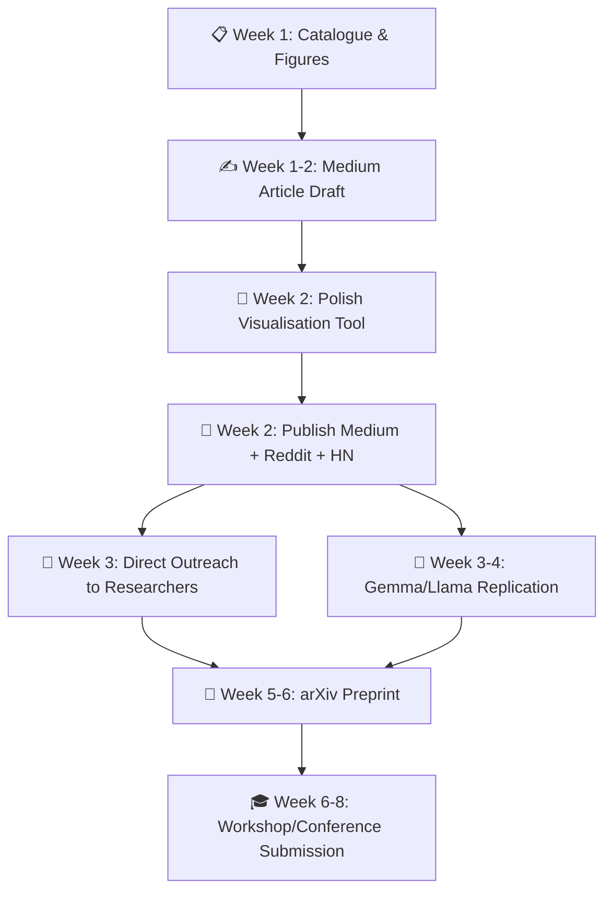

# Trajectory Geometry: Research Roadmap & Dissemination Strategy

> [!NOTE]
> **Snapshot Date:** 2026-02-10
> This is a point-in-time snapshot of the research roadmap. For the active version, see the artifacts directory.

## I. What We've Proven (The Findings Catalogue)

### Tier 1: Core Discoveries (Robust, Replicated)

| Finding | Evidence | Effect Size | Experiments |
|---------|----------|-------------|-------------|
| **Dimensional Collapse in Failure** | Failed reasoning collapses into low-dimensional subspace ($D_{eff}$ ≈ 3.4 vs 13.1) | Cohen's $d$ > 4.5 | 11, 12, 14 |
| **Regime-Relative Success** | "Good geometry" is opposite for CoT vs Direct answering | 10 of 14 metrics flip sign | 14 |
| **Difficulty-Driven Expansion** | Harder problems induce proportionally more geometric expansion | Cohen's $d$ > 17.0 | 15 |
| **Failure Subtypes** | Failures cluster into "Collapsed" (gave up) vs "Wandering" (got lost) | K=2 subtypes, clear separation | 13 |
| **Commitment Timing** | Measurable "moment of decision" in trajectory convergence | Direct: ~5 tokens, CoT: ~11 tokens | 12, 14 |
| **Geometry > Length** | Trajectory metrics predict success better than token count alone | AUC 0.79 vs 0.77 | 15 |
| **Predictive Power** | Geometry alone predicts correctness at AUC 0.898 (direct) | Logistic regression, 5-fold CV | 13 |

### Tier 2: Structural Findings

| Finding | Evidence | Experiments |
|---------|----------|-------------|
| **Middle-Layer Reasoning** | Geometric signals peak in layers 10-16 (semantic processing zone) | 12, 14 |
| **Layer Specialization** | Regime signals (early), success signals (mid), commitment signals (late) | 14 |
| **CoT as Dimensional Expansion** | CoT forces high-dimensional space regardless of outcome | 11 |
| **Overthinking Signature** | Forcing CoT on easy problems introduces measurable noise | 15 |
| **Scale Stability** | Effect sizes stable from 0.5B to 1.5B parameters | 16B |

### Tier 3: Negative Results (Equally Valuable)

| Finding | What It Ruled Out | Experiments |
|---------|-------------------|-------------|
| Static signatures don't exist | Operators aren't fixed vectors in embedding space | 1, 2, 3, 7 |
| API embeddings are insufficient | Must access internal hidden states | 1 |
| Cue-word triggering fails | Dynamics are emergent, not token-reactive | 8' |
| Cross-model needs capability floor | Can't measure reasoning geometry if model can't reason | 9B |

---

## II. The Replication Gap (Honest Assessment)

### What's Solid
- ✅ Replicated across scale (Qwen 0.5B → 1.5B)
- ✅ Pythia-70m salvage confirms architecture-independence signal
- ✅ Multiple metric suites (speed, curvature, $D_{eff}$, fractal dimension, tortuosity)
- ✅ Robust statistics (N=300, permutation tests, cross-validation)

### What's Missing
- ❌ **No non-Qwen full replication** — TinyLlama failed on capability, not geometry
- ❌ **Single task domain** — Only arithmetic reasoning tested
- ❌ **No frontier model test** — All models are < 2B parameters

### Verdict: You Have Enough to Publish, Not Enough to Generalize

You don't need more replication *before* publishing. You need to frame the scope honestly ("We demonstrate this in small transformers on arithmetic") and position replication as future work that invites collaboration.

---

## III. Prioritized Project Roadmap

### 🥇 Priority 1: The Catalogue Article (Do This First — 1-2 days)

**Why first:** You can't disseminate what you haven't synthesized. This document becomes the backbone of everything else.

**Deliverable:** `findings_catalogue.md` — A single, polished document that:
1. Lists every finding with its statistical evidence
2. Tells the research *story* (failure → pivot → discovery → validation)
3. Includes key figures (PCA trajectories, $D_{eff}$ distributions, commitment curves)
4. Explicitly separates "established" from "preliminary" findings

**Compute cost:** Zero. This is pure writing and figure curation.

---

### 🥈 Priority 2: The Medium Article (3-5 days)

**Why second:** This is your highest-ROI dissemination move. Medium reaches exactly the audience you want: curious ML engineers, interpretability researchers, and potential collaborators.

**Title suggestion:** *"What Does 'Thinking' Look Like Inside a Transformer? We Measured It."*

**Structure:**
1. **Hook:** "We found that when a language model reasons correctly, it literally moves differently through its own representational space"
2. **The Journey:** Brief narrative of how static approaches failed and dynamics succeeded
3. **The Money Shot:** Dimensional Collapse visualization — show how failed and successful trajectories look fundamentally different
4. **Key Findings:** 3-4 of the Tier 1 results, with clear visualizations
5. **What This Means:** Implications for AI safety, evaluation, and interpretability
6. **Call to Action:** Link to repo, invite collaborators, suggest replication targets

**Critical:** The 3D visualization tool is your **killer figure** for this article. An interactive demo or even a compelling static render of trajectories will make the article sharable.

**Compute cost:** Minimal. Generate a few final renders from the visualisation tool.

---

### 🥉 Priority 3: The Visualization Tool (1-2 weeks, in parallel)

**Why this matters:** Interactive visualizations are the most shareable artifact in ML research. A working demo of trajectories is worth a thousand statistical tables.

**Current state:** React/Vite/Three.js project exists with `trajectory_data.json` in place and basic structure scaffolded.

**Minimum viable demo:**
1. 3D PCA view of trajectories colored by group (G1-G4)
2. Toggle between Success/Failure to see dimensional collapse
3. Slider for layer depth to show where reasoning "appears"
4. Hover to see problem text and metrics

**Compute cost:** Low. Data is already generated. This is frontend work.

**Stretch goal:** Host on GitHub Pages or Vercel as a shareable link for the Medium article.

---

### Priority 4: Gemma/Llama Replication (1-2 weeks, when ready)

**Why not first:** You have enough for a compelling first publication. Replication *strengthens* the follow-up, not the opener.

**Target model:** Gemma-2B or Llama-3.2-1B (both run locally, well-documented architectures, different from Qwen)

**Scope:** Run the EXP-09 protocol (300 arithmetic problems, Direct + CoT, first 32 tokens, 3 key metrics) on the new model. Binary outcome: do the signatures replicate or not?

**Compute cost:** Moderate. ~2-4 hours GPU time depending on hardware.

---

### Priority 5: Preprint / Workshop Paper (2-4 weeks, after Medium traction)

**Why wait:** Let the Medium article find its audience first. If it gets traction, you'll have social proof and potentially co-authors.

**Target venues:**
- **ICML Workshop on Mechanistic Interpretability** (if timeline aligns)
- **arXiv preprint** (always available, establishes priority)
- **Distill.pub** (if visualization is strong — they love interactive articles)

---

## IV. Dissemination Strategy (Building Reputation Without Social Media)

### Phase 1: Establish the Work (Weeks 1-2)

| Action | Platform | Purpose |
|--------|----------|---------|
| Publish catalogue + first Medium article | Medium | Reach general ML audience |
| Submit to [Towards Data Science](https://towardsdatascience.com/) | Medium/TDS | Wider reach, editorial credibility |
| Cross-post to r/MachineLearning | Reddit | Technical audience, high engagement |
| Post to Hacker News | HN | Tech generalist audience |

> [!TIP]
> **Reddit and HN are your social media substitutes.** A single well-timed post on r/MachineLearning with a catchy title and clear figures can reach 100K+ views. The key is timing (post Tuesday-Thursday, morning US EST) and format (lead with the visual, link to full article).

### Phase 2: Find Collaborators (Weeks 2-4)

| Action | How | Why |
|--------|-----|-----|
| Email 3-5 researchers directly | Find authors of related papers (mechanistic interp, probing) and send a 3-paragraph email with your best figure | Direct outreach has ~10-20% response rate, much higher than cold social media |
| Join Eleuther AI Discord | Active community of open-source ML researchers | High density of people who care about transformer internals |
| Join MATS (ML Alignment Theory Scholars) community | Apply or engage in their public channels | Alignment-adjacent researchers are hungry for empirical geometry work |
| Post on Alignment Forum / LessWrong | Write a shorter version of your findings | These communities value empirical contributions and have high engagement |

### Phase 3: Formalize (Weeks 4-8)

| Action | Outcome |
|--------|---------|
| Gemma/Llama replication complete | Strengthens claims for paper |
| Write arXiv preprint | Establishes scientific priority |
| Submit to workshop or conference | Peer review and credibility |
| Release visualization tool as interactive demo | Shareable artifact for citations |

---

## V. What To Do First (The Exact Sequence)

### This Week (Days 1-3)
1. **Day 1:** Finalize the findings catalogue (this document, polished)
2. **Day 2:** Generate the 3-5 key figures from existing data (PCA trajectories, $D_{eff}$ boxplots, commitment curves, difficulty scaling)
3. **Day 3:** Start the Medium article outline

### Next Week (Days 4-7)
4. **Day 4-5:** Draft the Medium article
5. **Day 6:** Get the visualization tool into a deployable state (even a basic version)
6. **Day 7:** Publish, cross-post, and breathe

---

## VI. The Honest Pitch

When you describe this work to potential collaborators, lead with:

> *"I've run 16 experiments showing that when a transformer reasons correctly, its hidden states trace geometrically distinct trajectories compared to when it fails. The effect sizes are massive (Cohen's d > 4.5 for dimensional collapse, > 17 for difficulty scaling). I've replicated across model sizes but need help validating across architectures. I have an interactive visualization tool and I'm looking for collaborators to help scale this."*

This positions you as:
- **Empirical** (16 experiments, real data)
- **Rigorous** (effect sizes, cross-validation, permutation tests)
- **Honest** (acknowledges the replication gap)
- **Collaborative** (inviting, not territorial)

---

## VII. Risk Assessment

| Risk | Severity | Mitigation |
|------|----------|------------|
| Someone publishes similar findings first | Medium | Publish Medium article quickly to establish informal priority; arXiv for formal priority |
| Findings don't replicate on new architectures | High | Frame initial publication as "demonstrated in Qwen family"; replication is the call to action |
| Low engagement on Medium | Low | Cross-post to Reddit/HN/LessWrong; engagement compounds across platforms |
| Visualization tool takes too long | Medium | Publish with static figures first; interactive demo is a follow-up |
| Criticism of single-task (arithmetic) | Medium | Acknowledge explicitly; position task expansion as future work / collaboration opportunity |
