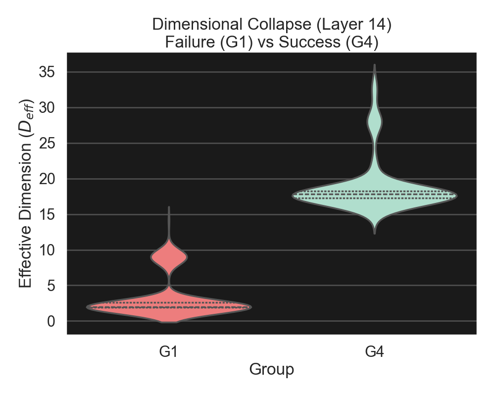
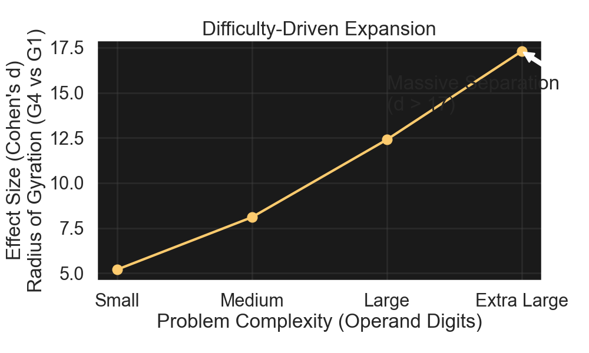
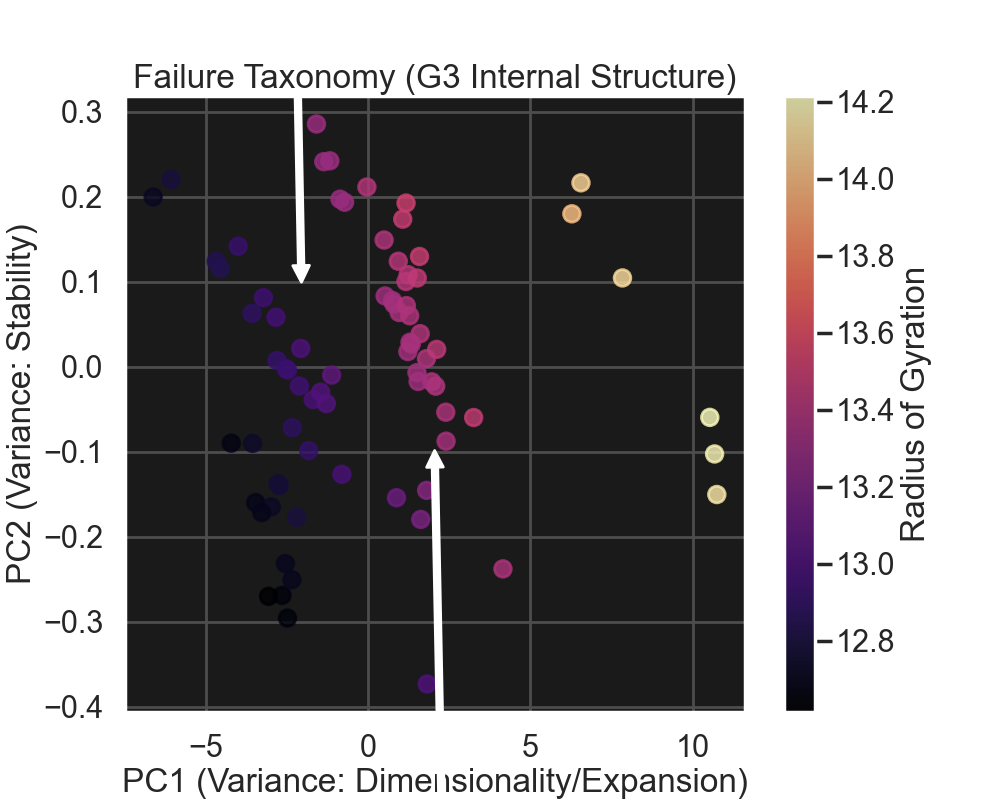
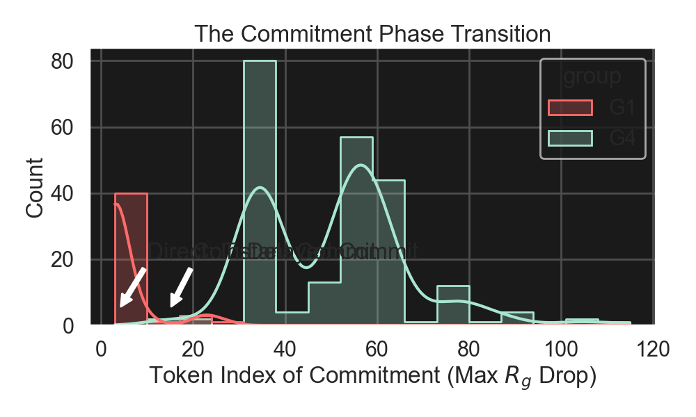

# Findings Catalogue: Trajectory Geometry

**Date:** 2026-03-06 *(updated from 2026-02-10)*
**Status:** Validated / ready for synthesis
**Context:** Summary of 25 experiments (EXP-01 through EXP-19B) investigating the geometric properties of transformer residual streams during reasoning tasks.

---

## 1. Preamble

This document catalogues the empirical findings of the **Trajectory Geometry** research project. The goal was to determine if high-level cognitive operations (Reasoning vs. Retrieval, Success vs. Failure) leave measurable geometric signatures in the model's latent space.

### Methodology Summary
*   **Primary Architecture:** Qwen2.5-0.5B (Decoder-only Transformer).
*   **Validation Architectures:** Qwen2.5-1.5B, Qwen2.5-3B (partial), Pythia-410m.
*   **Previously tested (invalidated):** Pythia-70m (data corruption, EXP-18B), TinyLlama-1.1B (below capability floor, EXP-09B).
*   **Task Domain:** Multi-step arithmetic reasoning (e.g., `(A * B) + C`).
*   **Technique:** Analysis of residual stream hidden states $h_t$ across all layers.
*   **Control:** All comparative analyses in EXP-01–13 restricted to the **first 32 tokens** to control for length confounds. EXP-14 onward uses full trajectories (up to 200 tokens).
*   **Metrics:** 54 geometric/dynamical indicators across 12 families (formalized EXP-18; see [Metrics Appendix](Metrics_Appendix_2026-02-10.md) and [Definitive Metric Suite](Trajectory_Geometry_Definitive_Metric_Suite.md)).
*   **Scale Range:** 410M–1.5B parameters architecturally validated; 3B partially tested.

---

## 2. Empirical Results (The Fact Layer)

The following results are statistically significant ($p < 0.001$, Permutation Test) and replicated across scale (0.5B $\to$ 1.5B) unless otherwise noted.

### 2.1 Dimensional Collapse in Failure
Failed reasoning trajectories exhibit a catastrophic collapse in dimensionality compared to successful reasoning. The model's computation is confined to a much narrower subspace when it fails.

*   **Metric:** Effective Dimension ($D_{eff}$, PCA Participation Ratio).
*   **Result:**
    *   **Successful CoT (G4):** Mean $D_{eff} \approx 13.1$
    *   **Failed Direct (G1):** Mean $D_{eff} \approx 3.4$
*   **Effect Size:** Cohen's $d > 4.5$ (Massive).
*   **Visual Evidence:**
    
*   **Source:** EXP-11, EXP-12.

### 2.2 Regime-Relative Success Geometry
There is no single "good" geometry. The geometric signature of success *flips sign* depending on the prompting regime (Direct vs. CoT).

*   **Observation:** 10 of 14 key metrics show opposite correlations with success in the two regimes.
    *   **CoT Success:** Characterized by **High Expansion** ($R_g \uparrow$), **Lower Speed**, and **Low Cosine Similarity** to final state (Delayed Commitment).
    *   **Direct Success:** Characterized by **Low Expansion** ($R_g \downarrow$), **Higher Speed**, and **High Cosine Similarity** (Early Commitment).
*   **Implication:** A "correct" Direct trajectory looks remarkably like a "failed" CoT trajectory (collapsed/efficient).
*   **Source:** EXP-14.

### 2.3 Difficulty-Driven Expansion
The magnitude of geometric expansion matches problem difficulty. The model selectively "spends" geometric volume to resolve complexity.

*   **Metric:** Radius of Gyration ($R_g$) at Layer 4.
*   **Result:**
    *   **Small Problems:** Effect size (CoT vs Direct) is moderate ($d \approx 5.0$).
    *   **Extra Large Problems:** Effect size spikes to $d > 17.0$.
*   **Visual Evidence:**
    
*   **Source:** EXP-15 (Analysis A).

### 2.4 Failure Subtypes (The Taxonomy of Error)
Unsupervised clustering of failure cases (G3) reveals two distinct structural subtypes. Failures are not monolithic.

*   **Subtype A (Collapsed Failure):**
    *   Low $D_{eff}$, Low $R_g$.
    *   Visually indistinguishable from Direct answers.
    *   *Interpretation:* Premature optimization / "Give up" mode.
*   **Subtype B (Wandering Failure):**
    *   High $D_{eff}$, High $R_g$ (often higher than success).
    *   Low Stabilization, Low Convergence.
    *   *Interpretation:* Active confusion / "Getting lost" mode.
*   **Visual Evidence:**
    
*   **Source:** EXP-13.

### 2.5 Commitment Timing
The "Phase Transition" from exploration to execution is measurable and distinct.

*   **Metric:** `time_to_commit` (Token index of maximum $R_g$ drop).
*   **Result:**
    *   **Direct Answers:** Commit at tokens 0–5.
    *   **CoT Answers:** Commit at tokens 11–20.
*   **Visual Evidence:**
    
*   **Layer Profile:** The commitment signal is strongest in **Late Layers (20–24)**.
*   **Source:** EXP-12, EXP-14.

### 2.6 Geometry vs. Length: Context-Dependent Predictive Power
The relative predictive power of geometry vs. response length depends strongly on analytical context (full cross-regime vs. within-regime).

*   **Full-context, cross-regime (EXP-15):**
    *   Length only: **AUC 0.77**
    *   Geometry only: AUC 0.64
    *   Combined: AUC 0.74
    *   *Note:* This comparison conflates regime effects with quality effects (see §2.8).

*   **Within-regime geometry-only (EXP-19B, CoT condition):**
    *   Qwen-0.5B (Layer 16): **AUC 0.78**
    *   Qwen-1.5B (Layer 26): **AUC 0.74**
    *   Regime-only baseline: AUC 0.50
    *   *Note:* Once regime is held constant, geometry substantially outperforms length alone.

*   **Conclusion:** The full-context geometry AUC of 0.64 was artificially depressed by regime-quality confounding. Within-regime geometry is a strong and independent predictor of success.

*   **Source:** EXP-15, EXP-19B.

---

### 2.7 Architecture-Invariant Geometric Signatures (EXP-19)
Nineteen geometric signatures were identified that hold consistently across the Qwen (LLaMA-style) and Pythia (GPT-style) transformer families.

*   **Models Tested:** Qwen2.5-0.5B, Qwen2.5-1.5B, Pythia-410m.
*   **Dataset:** 400 problems across 4 difficulty bins (Small, Medium, Large, Negative).
*   **Comparison:** CoT Success (G4) vs. Direct Failure (G1).

*   **Top Invariant Predictors (Cohen's $d$, aggregate cross-architecture):**

    | Metric | Aggregate $d$ | Best Single Measurement |
    | :--- | :--- | :--- |
    | `phase_count` | 31.66 | Pythia-410m L23: $d = 70.11$ |
    | `radius_of_gyration` | 13.99 | Qwen-1.5B L20: $d = 11.14$; Qwen-0.5B L0: $d = 9.10$ |
    | `effective_dimension` | 12.01 | — |
    | `commitment_sharpness` | 9.83 | — |
    | `tortuosity` | 6.93 | — |
    | `direction_consistency` | 6.45 | — |

*   **"The Snap" Phenomenon:** A sharp, measurable phase transition (Commitment Sharpness) occurs at the moment the model locks onto the correct solution. This is distinct from the gradual convergence in wandering failures.
*   **Physical Trajectory Persistence:** Geometric signals persist beyond the semantic answer boundary; the post-answer drift phase correlates strongly with the preceding reasoning quality.
*   **Source:** EXP-19 (`Experiment_19_Final_Report.md`, `Invariant_Geometric_Signatures_Report.md`).

---

### 2.8 Regime-Quality Variance Decomposition (EXP-19B)
A two-way ANOVA partitions the total geometric variance into regime-driven and quality-driven components, confirming that the "Success Attractor" is a real construct distinct from a mere CoT regime artefact.

*   **Design:** 2-way ANOVA (Regime × Correctness) across 20+ geometric metrics, all transformer layers, Qwen-0.5B and Qwen-1.5B.

*   **Main Effect (Regime / CoT vs. Direct):** Explains **~80–85%** of total geometric variance. CoT and Direct trajectories are physically separated in embedding space.
*   **Main Effect (Quality / Correctness):** Robust secondary effect, **η² ≈ 0.10**, persisting after controlling for regime. This is the "Success Attractor" signal.

*   **Within-Regime Predictive Power (CoT condition only):**

    | Model | Peak AUC | Layer |
    | :--- | :--- | :--- |
    | Qwen-0.5B | 0.78 | L16 (and L24) |
    | Qwen-1.5B | 0.74 | L26 |

    *   Significantly above regime-only baseline (AUC 0.50).
    *   Conclusion: The Success Attractor is **not** a vacuous synonym for "the CoT attractor."

*   **Interaction Signatures (Effect Flips):** Several metrics exhibit sign reversal between regimes, confirming that "success" is motionally distinct across regimes:

    | Metric | Layer | Direct ($d$) | CoT ($d$) | Sign Flip |
    | :--- | :--- | :--- | :--- | :--- |
    | `full_time_to_commit` | 3 | +1.50 | −0.38 | **YES** |
    | `clean_cos_slope_to_final` | 4 | −0.33 | +0.46 | **YES** |
    | `dir_consistency` (Qwen-1.5B) | — | Higher in success | Lower in success | **YES** |

*   **Source:** EXP-19B (`Invariant_Signatures_Report.md`, `Invariant_Geometric_Signatures_Report.md`).

---

### 2.9 PCR Attenuation Bias Correction (EXP-19B)
Raw geometric metrics systematically *underestimate* the true signal due to high per-token variance in short token sequences. Probability Cloud Regression (PCR) corrects this.

*   **Problem:** Standard logistic regression on raw geometric features suffers from attenuation bias — measurement noise compresses estimated AUC toward chance.
*   **Method (PCR):**
    1. Estimate per-trajectory uncertainty $\sigma$ from the standard deviation of each metric across layers.
    2. Denoise features via `CloudRegressor`, anchored to sample ID (leakage-free) rather than correctness labels.
    3. Re-run logistic regression on denoised features to estimate "True AUC."

*   **AUC Recovery Results (Qwen-0.5B):**

    | Layer | Raw AUC | PCR-Corrected AUC | Gain |
    | :--- | :--- | :--- | :--- |
    | 0 | 0.659 | 0.778 | **+0.119** |
    | 5 | 0.700 | 0.779 | **+0.079** |
    | 16 | 0.799 | 0.779 | −0.020 *(slight over-smooth)* |

*   **Key Interpretations:**
    *   The model forms **proto-attractors as early as Layer 0**. Raw measurements obscure this due to high per-token variance; PCR reveals it.
    *   Deep layers (L16+) already exhibit high SNR — PCR provides marginal or no gain.
    *   **Upper bound estimate:** True predictability is likely **>0.85** if measurement noise could be perfectly eliminated.
    *   Architecture invariance holds: Qwen-1.5B and Qwen-0.5B share the same Success Centroid mechanics, though the precision of the attractors scales with model size.

*   **Data files:** `pcr_denoised_metrics_qwen05b.csv` (25 MB), `pcr_denoised_metrics_qwen15b.csv` (29 MB), `pcr_anova_decomposition.csv` (425 KB) — all at `experiments/EXP-19_Robustness_2026-02-14/data/analysis_19b/`.
*   **Source:** EXP-19B (`EXP19_PCR_Comprehensive_Report.md`).

---

### 2.10 G3 Failure Attractor: Regime Entry vs. Commitment Failure (EXP-19B)
CoT failures (G3) are geometrically indistinguishable from Direct failures (G1) in aggregate — but a layer-resolved analysis reveals a more nuanced picture: G3 failures *successfully enter* the CoT regime attractor but fail to commit to the success centroid.

*   **Metric:** **Position Index (PI)** — measures where G3 (CoT Failure) falls on the axis between G1 (Direct Failure, PI = 0) and G4 (CoT Success, PI = 1).
*   **Aggregate result (Qwen-0.5B):** Mean PI ≈ **0.033** — G3 is geometrically almost identical to G1 overall.
*   **Layer-resolved result:** In **early layers**, G3 PI ~1.0 — CoT failures successfully enter the CoT regime attractor indistinguishably from successes.
*   **Interpretation:** G3 failure is not a *regime-entry* failure (the model reaches the CoT manifold) but a ***commitment failure*** — the trajectory reaches the CoT manifold but never converges on the Success Centroid. This refines the failure taxonomy from §2.4.

*   **Refined Failure Taxonomy:**
    *   **Subtype A (Collapsed Failure / G3-Regime-Miss):** Low $D_{eff}$, Low $R_g$; never enters CoT regime; PI ≈ 0. "Give up" mode.
    *   **Subtype B (Wandering Failure / G3-Commitment-Miss):** Enters CoT regime (PI ~1.0 early), then fails to commit; PI collapses late. "Gets lost" mode.
    *   This aligns with PI ~0 aggregate: most G3 failures spend most of their trajectory near G1, not G4.

*   **Source:** EXP-19B (`Invariant_Signatures_Report.md`, `EXP19_PCR_Comprehensive_Report.md`).

---

## 3. Interpretive Framework

These frameworks synthesize the empirical results into a coherent theory of transformer reasoning.

### 3.1 CoT as Dimensional Expansion
Reasoning is a **Dynamic State-Space Expansion** mechanism. Chain-of-Thought prompting works because it forces the model to "unfold" compressed representations into a high-dimensional manifold where they can be manipulated linearly.
*   *Success* = Sufficient expansion to resolve entropy.
*   *Failure* = Insufficient expansion (Collapse) or uncontrolled expansion (Wandering).

### 3.2 The "Explore $\to$ Commit" Phase Transition
Reasoning is a two-phase process:
1.  **Exploration Phase:** High dimensionality, high entropy, low cosine similarity to outcome. (Searching the solution space).
2.  **Commitment Phase:** Sharp collapse in dimensionality, rapid convergence to the answer token ("The Snap").
*   *Direct answers* skip Phase 1.
*   *CoT answers* spend 50–70% of steps in Phase 1.

### 3.3 Resource-Rational Reasoning
The model targets an optimal level of expansion for the problem entropy.
*   **Easy problems:** Expansion is wasteful (noise). The model stays "flat."
*   **Hard problems:** Expansion is necessary. The model "inflates" the latent space.
*   **Pathology:** "Overthinking" (Direct-Only Successes) occurs when the model expands on a problem that could have been solved flat.

### 3.4 The Success Attractor
Successful reasoning trajectories do not merely avoid collapse — they actively converge onto a tight, reproducible geometric manifold: the **Success Attractor**.

*   The attractor is **architecturally invariant**: the same structural manifold exists in both Qwen (LLaMA-style) and Pythia (GPT-style) families.
*   The attractor is **distinct from the CoT Regime Attractor**: G3 failures enter the CoT regime but never converge onto the Success Centroid (§2.10).
*   The attractor is **scaled by model capacity**: larger models (1.5B) exhibit tighter, more precise centroids than smaller models (0.5B).
*   **Proto-attractors** form as early as Layer 0 (confirmed by PCR denoising), suggesting commitment geometry is seeded in the earliest layers of processing.
*   **Future implication:** If proto-attractor state is detectable in early layers at inference time, it may be possible to redirect G3-bound trajectories toward the Success Attractor before commitment occurs.

---

## 4. Negative Results & Null Findings

*   **Static Signatures (EXP-01–07):** Attempts to find fixed "operator vectors" (e.g., a "Summarization Vector") in the embedding space failed ($AMI \approx 0$). Thought is a *trajectory*, not a *position*.
*   **Cue-Word Triggering (EXP-08'):** Injecting words like "Therefore" or "Wait" did not reliably trigger geometric phase transitions. Dynamics are emergent, not simply token-reactive.
*   **Cross-Model Triggering (EXP-09B):** TinyLlama-1.1B failed to replicate geometric signatures because it failed to *reason* (0% accuracy). Geometry requires a capability floor.
*   **Universal Success Signature (EXP-14):** Hypothesis H1 (that success always looks the same) was falsified. Success geometry is regime-dependent.
*   **Pythia-70m Data Integrity (EXP-18B):** Hidden state tensors were corrupted (1,536-dim instead of expected 512-dim), completely invalidating Pythia-70m results for the scaling geometry experiment. Mandatory pre-flight tensor shape validation is now a hard pipeline constraint.
*   **3B Scale (EXP-17):** Hardware ceiling (AMD RX 5700 XT, 8GB DirectML) precluded full replication at Qwen2.5-3B scale. The 3B data point is partial and not validated.

---

## 5. Methodological Notes

*   **Control Window (EXP-01 $\to$ EXP-13):** Metrics computed on the **first 32 tokens**.
*   **Full Trajectory Capture (EXP-14 onward):** Experiments 14, 16B, and 19 use **full trajectories** (up to 128–200 tokens) to capture late-stage dynamics.
*   **Physical Trajectory Preservation (EXP-19):** 1,200 full 200-token trajectories extracted and stored on external HDD (D: drive), with metadata on SSD. Geometric signals confirmed to persist beyond semantic answer boundaries; post-answer drift correlates with preceding reasoning quality.
*   **Few-Shot Calibration (EXP-19):** Replaced zero-shot with CoT-guided few-shot examples to enable non-zero accuracy in the 410M model (Pythia-410m: 5% CoT vs. ~0% without calibration).
*   **Anti-Contamination Pipeline (EXP-19):** Multi-stage guardrails (prompt engineering, generation stop sequences, post-generation text truncation, boundary detection) resolved the "runaway hallucination" problem from EXP-16/16B.
*   **Hallucination Truncation (EXP-16):** "Runaway" generations identified via regex stop-sequence pipeline and strictly truncated.
*   **Metric Suite Standardization (EXP-18):** Formalized `TrajectoryMetrics` class computing 54 metrics across 12 families. Project shifted from exploratory analysis to standardized replication-ready framework.
*   **PCR Denoising (EXP-19B):** Probability Cloud Regression applied to Qwen-0.5B and Qwen-1.5B. Denoised metric tables and PCR ANOVA decomposition available at `experiments/EXP-19_Robustness_2026-02-14/data/analysis_19b/`.
*   **Permutation Testing:** All group differences (G1 vs G4) validated with 10,000-shuffle permutation tests, $p < 0.001$.

---

## 7. Comparative Analysis (Cross-Architecture)

**Objective:** Validation of geometric signatures across model scales and architectures.

### 7.1 EXP-19 Multi-Architecture Accuracy

| Model | UltraSmall (%) | Small (%) | Overall CoT (%) |
| :--- | :--- | :--- | :--- |
| **Qwen2.5-1.5B** | 100.0 | 100.0 | **95.0** |
| **Qwen2.5-0.5B** | 100.0 | 50.0 | **45.0** |
| **Pythia-410m** | 25.0 | 0.0 | **5.0** |

*Note: Few-shot calibration enabled non-zero accuracy for Pythia-410m.*

### 7.2 The Relativity of Success
The geometric signature of "Success" is relative to the model's dominant failure mode.

*   **Qwen 0.5B (EXP-14):**
    *   **Failure Mode:** Collapse (Repetition/Looping). Low $R_g$, Low Dim.
    *   **Success Signature:** **Expansion** (Success $R_g \gg$ Failure $R_g$).
    *   *Result:* Success looks like "opening up" the space.

*   **Qwen 1.5B (EXP-16B, EXP-19) & Pythia-410m (EXP-19):**
    *   **Failure Mode:** Wandering (Hallucination/Gibberish). High $R_g$, High Dim.
    *   **Success Signature:** **Compression/Focus** (Success $R_g <$ Failure $R_g$).
    *   *Result:* Success looks like "constraining" the space against entropy.

**Conclusion:** There is no universal "Success Direction" (Up or Down). Success is a "Goldilocks" zone of **Controlled Expansion** — distinct from the extremes of Collapse (0.5B) and Wandering (1.5B/410m).

### 7.3 Layer-wise Divergence Patterns

*   **Qwen 0.5B:** Geometric divergence between G1 and G4 begins at **Layer 12** (Mid) and grows monotonically toward late layers.
*   **Qwen 1.5B:** Divergence is **early-onset**; the larger model commits to a computational mode (Wandering vs. Reasoning) earlier in the forward pass.
*   **Pythia-410m:** `phase_count` at Layer 23 produces extraordinary effect sizes ($d = 70.11$), indicating that the oscillatory/phase structure of failure is architecturally diagnostic for GPT-style models.

### 7.4 Validated Scale Range

*   **Fully validated:** 410M–1.5B parameters (Qwen-0.5B, Qwen-1.5B, Pythia-410m).
*   **Partially tested:** 3B (Qwen2.5-3B, EXP-17 — hardware constraints precluded full replication).
*   **Invalidated:** Pythia-70m (EXP-18B data corruption), TinyLlama-1.1B (below capability floor).

---

## 6. Figure Index (Conceptual)

*   **Figure A: The Collapse.** (Data: EXP-14). Boxplot of $D_{eff}$ showing massive separation between G4 (Success) and G1 (Fail). `figures/FigA_TheCollapse_Publication.png`
*   **Figure B: The Fork.** (Conceptual). Schematic showing how CoT success expands while Direct success compresses.
*   **Figure C: Difficulty Scaling.** (Data: EXP-15). Line plot of Cohen's $d$ ($R_g$) vs Problem Size (Small $\to$ XL). `figures/FigC_DifficultyScaling_Publication.png`
*   **Figure D: Failure Taxonomy.** (Data: EXP-14). PCA scatter plot of G3 failures showing distinctive "Collapsed" and "Wandering" clusters. `figures/FigD_FailureTaxonomy_Publication.png`
*   **Figure E: The Commitment Curve.** (Data: EXP-14). Time-series of Radius of Gyration for G4 vs G1, showing the delayed phase transition in successful reasoning. `figures/FigE_CommitmentCurve_Publication.png`
*   **Figure F: PCR AUC Comparison.** (Data: EXP-19B). Bar chart of Raw vs. PCR-Corrected AUC by layer. `experiments/EXP-19_Robustness_2026-02-14/data/analysis_19b/pcr_auc_comparison.png`
*   **Figure G: Effect Localization.** (Data: EXP-19B). Layer-wise effect size comparison: Regime effects (black dashed) vs. Quality effects (red/blue). `experiments/EXP-19_Robustness_2026-02-14/data/analysis_19b/pcr_effect_localization_qwen05b.png`
*   **Figure H: G3 Position Heatmap.** (Data: EXP-19B). Heatmap of Position Index (PI) across layers for Qwen-0.5B, showing early-layer regime entry and late-layer commitment failure. `experiments/EXP-19_Robustness_2026-02-14/data/analysis_19b/pcr_position_heatmap_qwen05b.png`
*   **Figure I: Variance Decomposition.** (Data: EXP-19B). Stacked bar plot of η² for Regime vs. Quality across layers and metrics. `experiments/EXP-19_Robustness_2026-02-14/data/analysis_19b/pcr_variance_decomp_pcr_qwen05b.png`

For full definitions of all metrics, see [Metrics_Appendix_2026-02-10.md](Metrics_Appendix_2026-02-10.md) and [Trajectory_Geometry_Definitive_Metric_Suite.md](Trajectory_Geometry_Definitive_Metric_Suite.md).
