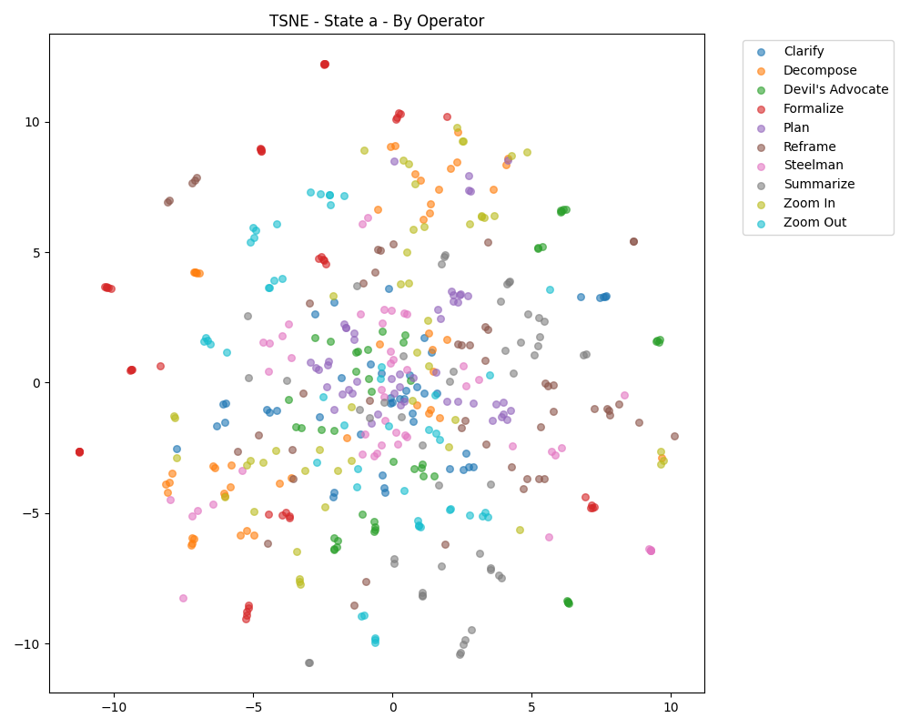
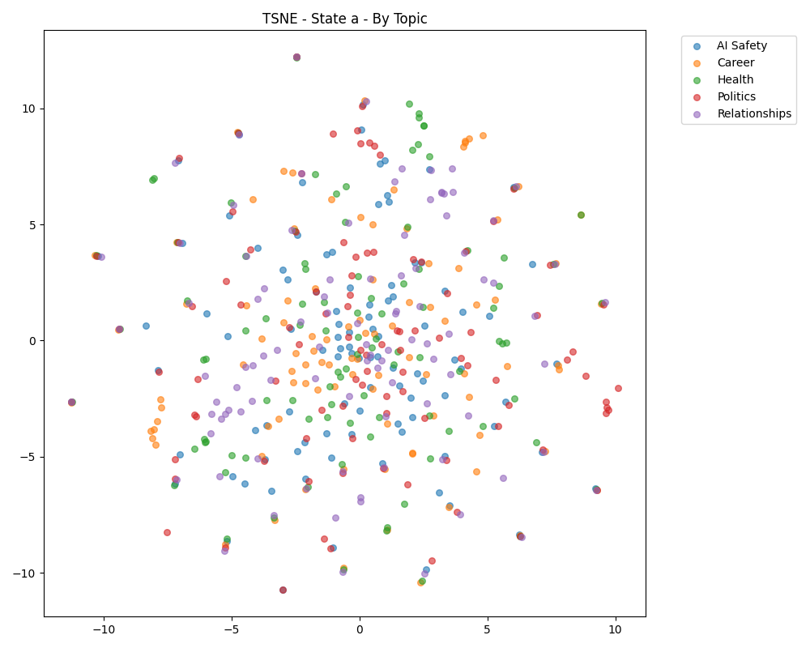
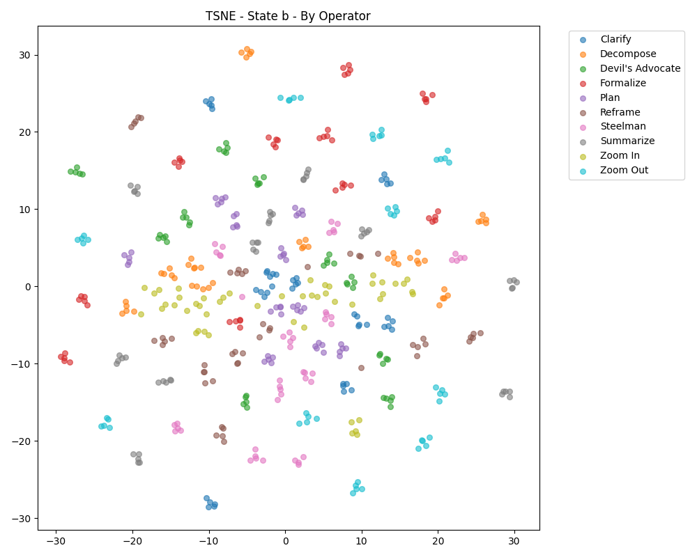
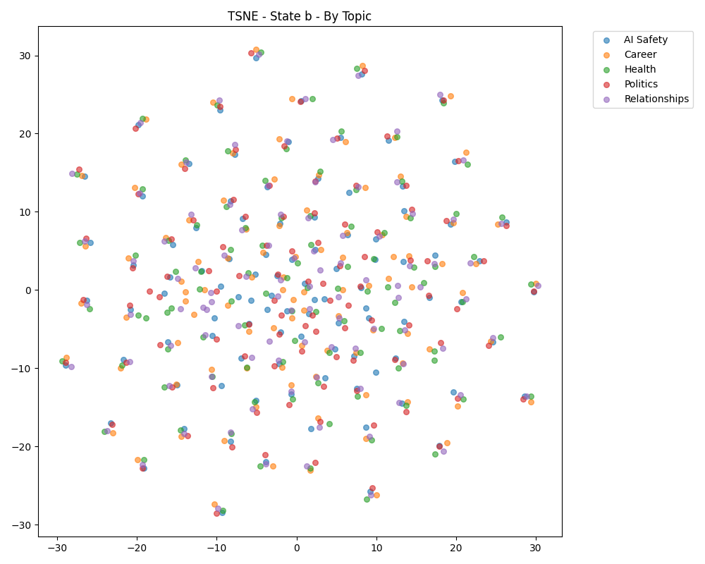
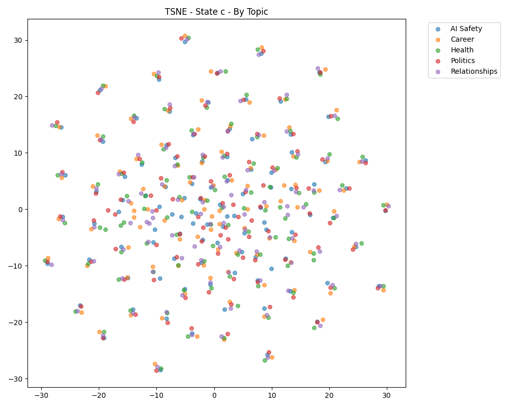

# Clustering Analysis Report

## State Definition: a
### HDBSCAN
- Clusters Found: 0
- Silhouette Score: -1.000
- AMI (Operator): **0.000**
- AMI (Topic): 0.000
### K-Means (k=10, 10 seeds)
- Avg Silhouette: 0.016 (±0.006)
- Avg AMI (Operator): **0.130**
- Avg AMI (Topic): -0.002

**Hypothesis Check:**
> ✅ H1 & H3 Supported: Clusters align better with Operators than Topics.

**Visualizations:**

---

## State Definition: b
### HDBSCAN
- Clusters Found: 0
- Silhouette Score: -1.000
- AMI (Operator): **0.000**
- AMI (Topic): 0.000
### K-Means (k=10, 10 seeds)
- Avg Silhouette: 0.019 (±0.009)
- Avg AMI (Operator): **0.138**
- Avg AMI (Topic): -0.017

**Hypothesis Check:**
> ✅ H1 & H3 Supported: Clusters align better with Operators than Topics.

**Visualizations:**

---

## State Definition: c
### HDBSCAN
- Clusters Found: 0
- Silhouette Score: -1.000
- AMI (Operator): **0.000**
- AMI (Topic): 0.000
### K-Means (k=10, 10 seeds)
- Avg Silhouette: 0.019 (±0.009)
- Avg AMI (Operator): **0.138**
- Avg AMI (Topic): -0.017

**Hypothesis Check:**
> ✅ H1 & H3 Supported: Clusters align better with Operators than Topics.

**Visualizations:**

---
