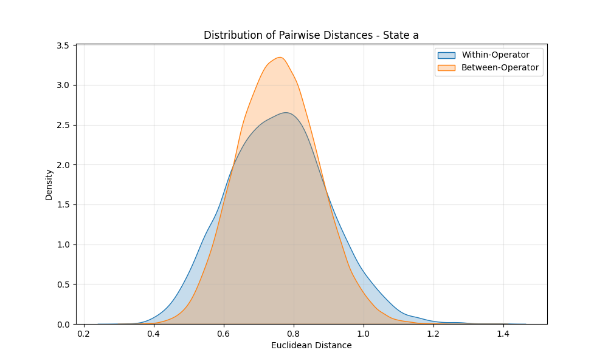
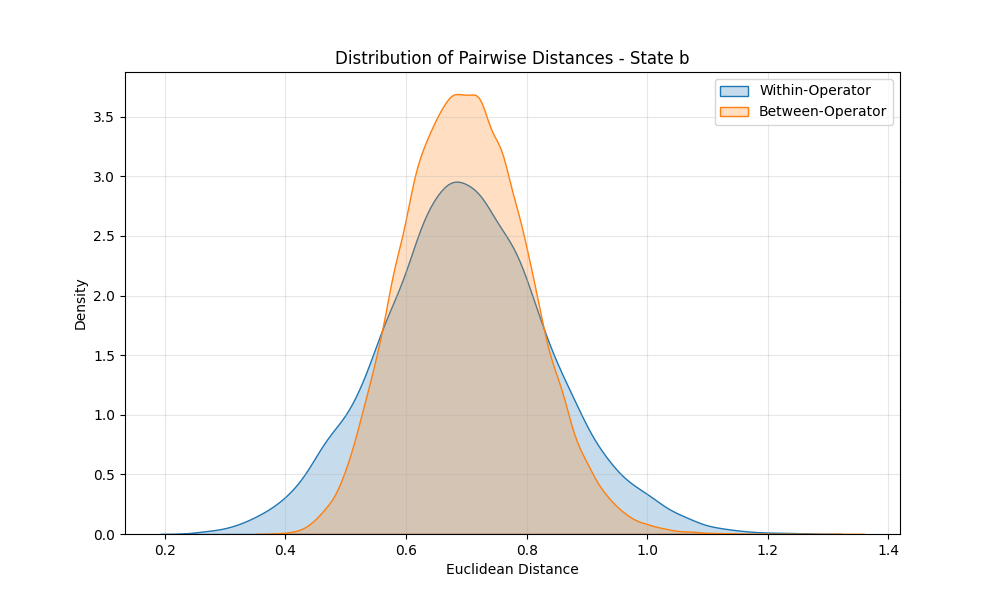

# Robustness Analysis Report

Analyzing the distribution of warp vectors across paraphrases and topics.
We compare **Within-Operator** variance (variance of vectors belonging to the same operator) vs **Between-Operator** variance.

## State Definition: a
### Variance Analysis (ANOVA-like)
- **Within-Operator Variance:** 0.2957
- **Between-Operator Variance:** 0.1121
- **Ratio (Between/Within):** 0.38
> ❌ **FAIL:** Within-operator variance is higher or equal.

### Distance Distributions

- Mean Distance (Within): 0.7562
- Mean Distance (Between): 0.7553

---

## State Definition: b
### Variance Analysis (ANOVA-like)
- **Within-Operator Variance:** 0.2531
- **Between-Operator Variance:** 0.1363
- **Ratio (Between/Within):** 0.54
> ❌ **FAIL:** Within-operator variance is higher or equal.

### Distance Distributions

- Mean Distance (Within): 0.6982
- Mean Distance (Between): 0.7006

---

## State Definition: c
### Variance Analysis (ANOVA-like)
- **Within-Operator Variance:** 0.2531
- **Between-Operator Variance:** 0.1363
- **Ratio (Between/Within):** 0.54
> ❌ **FAIL:** Within-operator variance is higher or equal.

### Distance Distributions

- Mean Distance (Within): 0.6982
- Mean Distance (Between): 0.7006

---
