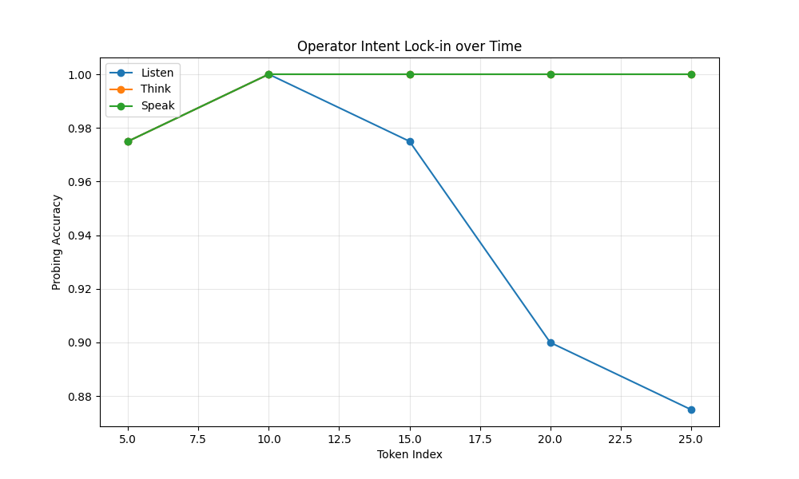

# Cross-Regime Operator Invariants Report

## 1. Probing Results
| Regime | Accuracy | Macro-F1 |
| :--- | :--- | :--- |
| Listen | 0.8500 | 0.8362 |
| Think | 1.0000 | 1.0000 |
| Speak | 1.0000 | 1.0000 |

## 2. Intent Lock-in

## 3. Topic Leakage
- Listen Regime Topic Accuracy: 1.0000
- Think Regime Topic Accuracy: 1.0000
- Speak Regime Topic Accuracy: 1.0000

## 4. Coupling Maps
- F (Listen -> Think) R²: 0.0641
- G (Think -> Speak) R²: 0.0263
- Mapped (F(Listen)) Operator Acc: 0.1000

## 5. Invariant Space (CCA)
- CCA Alignment Accuracy: 0.2750
