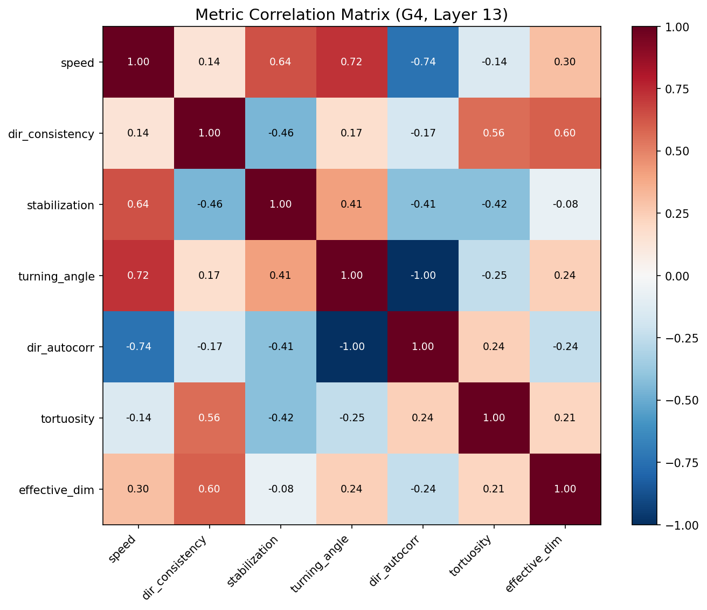
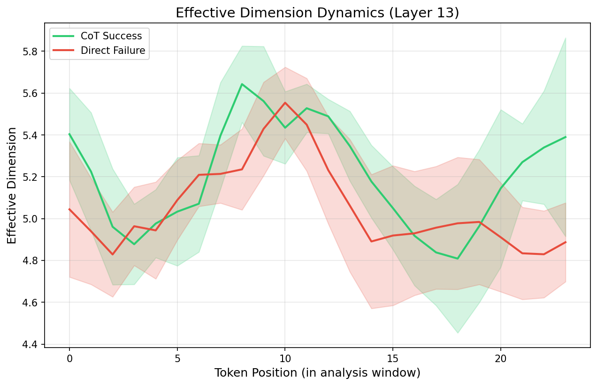

# Experiment 11: Extended Metric Suite Report

**Generated**: 2026-02-02 16:33
**Model**: Qwen/Qwen2.5-0.5B
**N Problems**: 300

---

## 1. Group Sizes

| Group | Description | N |
|---|---|---|
| G1 | Direct Failure | 229 |
| G2 | Direct Success | 53 |
| G3 | CoT Failure | 77 |
| G4 | CoT Success | 223 |

---

## 2. New Metrics: Primary Comparison (G4 vs G1)

| Layer | Metric | G4 Mean | G1 Mean | Cohen's d | p-value | Sig? |
|---|---|---|---|---|---|---|
| 0 | turning_angle | 2.0243 | 1.9396 | 0.58 | 0.0000 | ✓ |
| 0 | dir_autocorr | -0.4326 | -0.3345 | -0.90 | 0.0000 | ✓ |
| 0 | tortuosity | 0.0356 | 0.4009 | -2.57 | 0.0000 | ✓ |
| 0 | effective_dim | 8.5970 | 2.3540 | 5.66 | 0.0000 | ✓ |
| 10 | turning_angle | 1.9344 | 1.8691 | 1.36 | 0.0000 | ✓ |
| 10 | dir_autocorr | -0.3524 | -0.2921 | -1.31 | 0.0000 | ✓ |
| 10 | tortuosity | 0.0395 | 0.3479 | -2.80 | 0.0000 | ✓ |
| 10 | effective_dim | 13.0858 | 3.3545 | 4.58 | 0.0000 | ✓ |
| 13 | turning_angle | 1.9158 | 1.8493 | 1.40 | 0.0000 | ✓ |
| 13 | dir_autocorr | -0.3340 | -0.2731 | -1.33 | 0.0000 | ✓ |
| 13 | tortuosity | 0.0434 | 0.3478 | -2.76 | 0.0000 | ✓ |
| 13 | effective_dim | 12.9819 | 3.4211 | 4.41 | 0.0000 | ✓ |
| 16 | turning_angle | 1.8988 | 1.8246 | 1.46 | 0.0000 | ✓ |
| 16 | dir_autocorr | -0.3178 | -0.2495 | -1.39 | 0.0000 | ✓ |
| 16 | tortuosity | 0.0466 | 0.3578 | -2.76 | 0.0000 | ✓ |
| 16 | effective_dim | 12.9963 | 3.4658 | 4.29 | 0.0000 | ✓ |
| 24 | turning_angle | 1.9486 | 1.7559 | 2.33 | 0.0000 | ✓ |
| 24 | dir_autocorr | -0.3599 | -0.1807 | -2.25 | 0.0000 | ✓ |
| 24 | tortuosity | 0.0469 | 0.4141 | -2.71 | 0.0000 | ✓ |
| 24 | effective_dim | 7.9027 | 2.8394 | 3.11 | 0.0000 | ✓ |

---

## 3. Factorial Decomposition (New Metrics)

### 3.1 Success Effect Within CoT (G4 vs G3)

| Layer | Metric | G4 Mean | G3 Mean | Cohen's d | p | Sig? |
|---|---|---|---|---|---|---|
| 0 | turning_angle | 2.0243 | 2.0488 | -0.75 | 0.0000 | ✓ |
| 0 | dir_autocorr | -0.4326 | -0.4494 | 0.62 | 0.0000 | ✓ |
| 0 | tortuosity | 0.0356 | 0.0352 | 0.24 | 0.0660 |  |
| 0 | effective_dim | 8.5970 | 9.1121 | -0.65 | 0.0000 | ✓ |
| 10 | turning_angle | 1.9344 | 1.9376 | -0.31 | 0.0240 |  |
| 10 | dir_autocorr | -0.3524 | -0.3552 | 0.29 | 0.0280 |  |
| 10 | tortuosity | 0.0395 | 0.0404 | -0.38 | 0.0050 |  |
| 10 | effective_dim | 13.0858 | 13.8644 | -0.82 | 0.0000 | ✓ |
| 13 | turning_angle | 1.9158 | 1.9222 | -0.53 | 0.0000 | ✓ |
| 13 | dir_autocorr | -0.3340 | -0.3398 | 0.51 | 0.0000 | ✓ |
| 13 | tortuosity | 0.0434 | 0.0438 | -0.16 | 0.2600 |  |
| 13 | effective_dim | 12.9819 | 13.6274 | -0.77 | 0.0000 | ✓ |
| 16 | turning_angle | 1.8988 | 1.9096 | -0.62 | 0.0000 | ✓ |
| 16 | dir_autocorr | -0.3178 | -0.3275 | 0.60 | 0.0000 | ✓ |
| 16 | tortuosity | 0.0466 | 0.0467 | -0.09 | 0.4980 |  |
| 16 | effective_dim | 12.9963 | 13.4566 | -0.66 | 0.0000 | ✓ |
| 24 | turning_angle | 1.9486 | 1.9549 | -0.39 | 0.0040 |  |
| 24 | dir_autocorr | -0.3599 | -0.3647 | 0.32 | 0.0190 |  |
| 24 | tortuosity | 0.0469 | 0.0455 | 0.24 | 0.0650 |  |
| 24 | effective_dim | 7.9027 | 7.5353 | 0.51 | 0.0000 | ✓ |

### 3.2 Success Effect Within Direct (G2 vs G1)

| Layer | Metric | G2 Mean | G1 Mean | Cohen's d | p | Sig? |
|---|---|---|---|---|---|---|
| 0 | turning_angle | 1.9980 | 1.9396 | 0.31 | 0.0440 |  |
| 0 | dir_autocorr | -0.3984 | -0.3345 | -0.46 | 0.0040 |  |
| 0 | tortuosity | 0.0653 | 0.4009 | -1.85 | 0.0000 | ✓ |
| 0 | effective_dim | 5.1561 | 2.3540 | 2.09 | 0.0000 | ✓ |
| 10 | turning_angle | 1.8966 | 1.8691 | 0.45 | 0.0050 |  |
| 10 | dir_autocorr | -0.3178 | -0.2921 | -0.44 | 0.0020 |  |
| 10 | tortuosity | 0.0688 | 0.3479 | -1.97 | 0.0000 | ✓ |
| 10 | effective_dim | 8.2853 | 3.3545 | 1.85 | 0.0000 | ✓ |
| 13 | turning_angle | 1.8787 | 1.8493 | 0.49 | 0.0010 |  |
| 13 | dir_autocorr | -0.3009 | -0.2731 | -0.48 | 0.0000 |  |
| 13 | tortuosity | 0.0695 | 0.3478 | -1.96 | 0.0000 | ✓ |
| 13 | effective_dim | 8.3453 | 3.4211 | 1.79 | 0.0000 | ✓ |
| 16 | turning_angle | 1.8473 | 1.8246 | 0.36 | 0.0160 |  |
| 16 | dir_autocorr | -0.2711 | -0.2495 | -0.35 | 0.0210 |  |
| 16 | tortuosity | 0.0723 | 0.3578 | -1.97 | 0.0000 | ✓ |
| 16 | effective_dim | 8.6906 | 3.4658 | 1.84 | 0.0000 | ✓ |
| 24 | turning_angle | 1.8878 | 1.7559 | 1.25 | 0.0000 | ✓ |
| 24 | dir_autocorr | -0.3065 | -0.1807 | -1.23 | 0.0000 | ✓ |
| 24 | tortuosity | 0.0668 | 0.4141 | -2.00 | 0.0000 | ✓ |
| 24 | effective_dim | 6.6245 | 2.8394 | 1.84 | 0.0000 | ✓ |

### 3.3 Prompting Effect (G3 vs G1 - both failed)

| Layer | Metric | G3 Mean | G1 Mean | Cohen's d | p | Sig? |
|---|---|---|---|---|---|---|
| 0 | turning_angle | 2.0488 | 1.9396 | 0.62 | 0.0000 | ✓ |
| 0 | dir_autocorr | -0.4494 | -0.3345 | -0.88 | 0.0000 | ✓ |
| 0 | tortuosity | 0.0352 | 0.4009 | -2.12 | 0.0000 | ✓ |
| 0 | effective_dim | 9.1121 | 2.3540 | 5.37 | 0.0000 | ✓ |
| 10 | turning_angle | 1.9376 | 1.8691 | 1.18 | 0.0000 | ✓ |
| 10 | dir_autocorr | -0.3552 | -0.2921 | -1.14 | 0.0000 | ✓ |
| 10 | tortuosity | 0.0404 | 0.3479 | -2.30 | 0.0000 | ✓ |
| 10 | effective_dim | 13.8644 | 3.3545 | 4.14 | 0.0000 | ✓ |
| 13 | turning_angle | 1.9222 | 1.8493 | 1.27 | 0.0000 | ✓ |
| 13 | dir_autocorr | -0.3398 | -0.2731 | -1.21 | 0.0000 | ✓ |
| 13 | tortuosity | 0.0438 | 0.3478 | -2.27 | 0.0000 | ✓ |
| 13 | effective_dim | 13.6274 | 3.4211 | 3.91 | 0.0000 | ✓ |
| 16 | turning_angle | 1.9096 | 1.8246 | 1.41 | 0.0000 | ✓ |
| 16 | dir_autocorr | -0.3275 | -0.2495 | -1.33 | 0.0000 | ✓ |
| 16 | tortuosity | 0.0467 | 0.3578 | -2.27 | 0.0000 | ✓ |
| 16 | effective_dim | 13.4566 | 3.4658 | 3.73 | 0.0000 | ✓ |
| 24 | turning_angle | 1.9549 | 1.7559 | 1.99 | 0.0000 | ✓ |
| 24 | dir_autocorr | -0.3647 | -0.1807 | -1.91 | 0.0000 | ✓ |
| 24 | tortuosity | 0.0455 | 0.4141 | -2.24 | 0.0000 | ✓ |
| 24 | effective_dim | 7.5353 | 2.8394 | 2.41 | 0.0000 | ✓ |

### 3.4 Prompting Effect (G4 vs G2 - both succeeded)

| Layer | Metric | G4 Mean | G2 Mean | Cohen's d | p | Sig? |
|---|---|---|---|---|---|---|
| 0 | turning_angle | 2.0243 | 1.9980 | 0.55 | 0.0000 | ✓ |
| 0 | dir_autocorr | -0.4326 | -0.3984 | -1.02 | 0.0000 | ✓ |
| 0 | tortuosity | 0.0356 | 0.0653 | -1.21 | 0.0000 | ✓ |
| 0 | effective_dim | 8.5970 | 5.1561 | 3.94 | 0.0000 | ✓ |
| 10 | turning_angle | 1.9344 | 1.8966 | 2.86 | 0.0000 | ✓ |
| 10 | dir_autocorr | -0.3524 | -0.3178 | -2.78 | 0.0000 | ✓ |
| 10 | tortuosity | 0.0395 | 0.0688 | -1.23 | 0.0000 | ✓ |
| 10 | effective_dim | 13.0858 | 8.2853 | 4.58 | 0.0000 | ✓ |
| 13 | turning_angle | 1.9158 | 1.8787 | 2.83 | 0.0000 | ✓ |
| 13 | dir_autocorr | -0.3340 | -0.3009 | -2.68 | 0.0000 | ✓ |
| 13 | tortuosity | 0.0434 | 0.0695 | -1.07 | 0.0000 | ✓ |
| 13 | effective_dim | 12.9819 | 8.3453 | 4.70 | 0.0000 | ✓ |
| 16 | turning_angle | 1.8988 | 1.8473 | 2.72 | 0.0000 | ✓ |
| 16 | dir_autocorr | -0.3178 | -0.2711 | -2.62 | 0.0000 | ✓ |
| 16 | tortuosity | 0.0466 | 0.0723 | -1.10 | 0.0000 | ✓ |
| 16 | effective_dim | 12.9963 | 8.6906 | 4.71 | 0.0000 | ✓ |
| 24 | turning_angle | 1.9486 | 1.8878 | 2.33 | 0.0000 | ✓ |
| 24 | dir_autocorr | -0.3599 | -0.3065 | -2.18 | 0.0000 | ✓ |
| 24 | tortuosity | 0.0469 | 0.0668 | -0.66 | 0.0000 | ✓ |
| 24 | effective_dim | 7.9027 | 6.6245 | 1.57 | 0.0000 | ✓ |

---

## 4. Metric Independence

Correlation between new metrics and Directional Consistency (Layer 13, G4):

| Metric | r(DC) |
|---|---|
| turning_angle | 0.169 |
| dir_autocorr | -0.168 |
| tortuosity | 0.556 |
| effective_dim | 0.600 |

---

## 5. Effective Dimension Dynamics

Does effective dimension decrease over generation (explore→commit)?

- **G4 mean slope**: -0.0017 (negative = contraction)
- **G1 mean slope**: -0.0085 (negative = contraction)

---

## 6. Summary

**New metrics with significant effects (p<0.05, |d|>0.5)**:

- G4 vs G1 (primary): 20/20
- G4 vs G3 (success within CoT): 11/20
- G2 vs G1 (success within Direct): 12/20
- G3 vs G1 (prompting effect): 20/20
- G4 vs G2 (prompting, successes): 20/20

---

*Report generated by run_exp11_analysis.py*