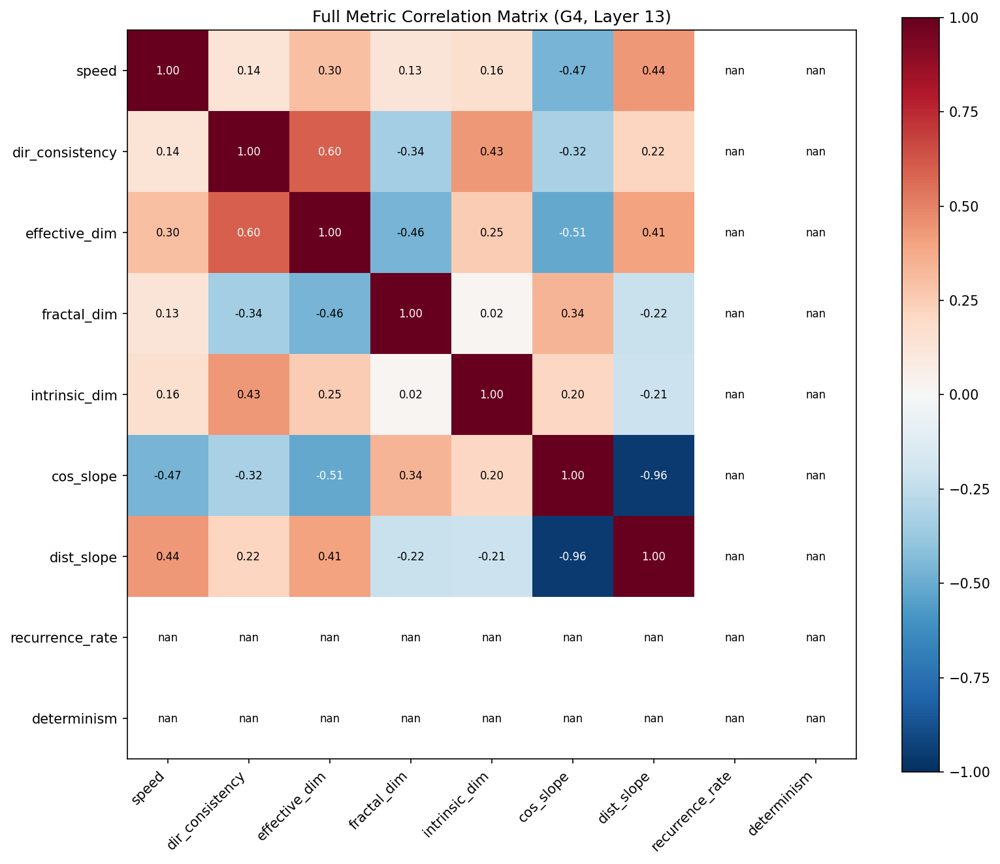
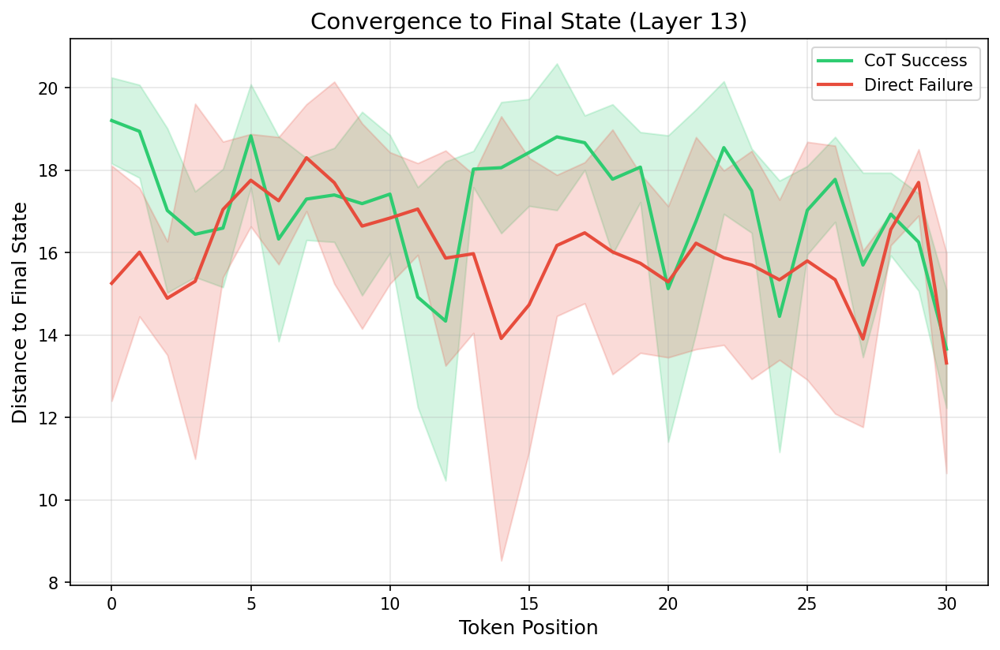
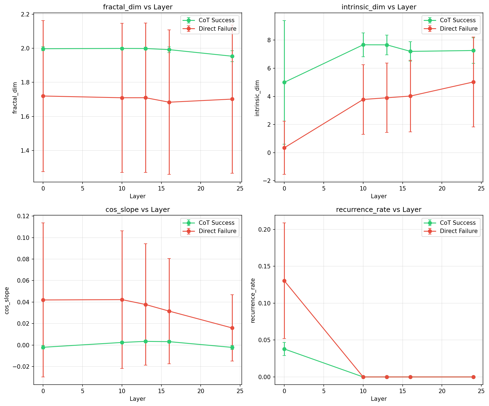

# Experiment 12: Advanced Trajectory Diagnostics Report

**Generated**: 2026-02-02 16:10
**Model**: Qwen/Qwen2.5-0.5B
**N Problems**: 300

---

## 1. Group Sizes

| Group | Description | N |
|---|---|---|
| G1 | Direct Failure | 62 |
| G2 | Direct Success | 52 |
| G3 | CoT Failure | 77 |
| G4 | CoT Success | 223 |

---

## 2. New Metrics: Primary Comparison (G4 vs G1)

| Layer | Metric | G4 Mean | G1 Mean | Cohen's d | p-value | Sig? |
|---|---|---|---|---|---|---|
| 0 | fractal_dim | 1.9972 | 1.7201 | 1.34 | 0.0000 | ✓ |
| 0 | intrinsic_dim | 5.0030 | 0.3476 | 1.16 | 0.0000 | ✓ |
| 0 | cos_slope | -0.0020 | 0.0420 | -1.31 | 0.0000 | ✓ |
| 0 | dist_slope | 0.0011 | -0.0454 | 1.25 | 0.0000 | ✓ |
| 0 | early_late_ratio | 0.8921 | 146.1424 | -0.88 | 0.0000 | ✓ |
| 0 | recurrence_rate | 0.0379 | 0.1303 | -2.46 | 0.0000 | ✓ |
| 0 | determinism | 0.3732 | 0.3317 | 0.29 | 0.0530 |  |
| 10 | fractal_dim | 1.9990 | 1.7099 | 1.41 | 0.0000 | ✓ |
| 10 | intrinsic_dim | 7.6705 | 3.7829 | 2.81 | 0.0000 | ✓ |
| 10 | cos_slope | 0.0025 | 0.0423 | -1.33 | 0.0000 | ✓ |
| 10 | dist_slope | -0.0343 | -0.7269 | 1.32 | 0.0000 | ✓ |
| 10 | early_late_ratio | 0.9983 | 1.1740 | -1.57 | 0.0000 | ✓ |
| 10 | recurrence_rate | 0.0000 | 0.0000 | 0.00 | 1.0000 |  |
| 10 | determinism | 0.0000 | 0.0000 | 0.00 | 1.0000 |  |
| 13 | fractal_dim | 1.9985 | 1.7100 | 1.41 | 0.0000 | ✓ |
| 13 | intrinsic_dim | 7.6672 | 3.9031 | 2.86 | 0.0000 | ✓ |
| 13 | cos_slope | 0.0035 | 0.0378 | -1.30 | 0.0000 | ✓ |
| 13 | dist_slope | -0.0534 | -0.7185 | 1.30 | 0.0000 | ✓ |
| 13 | early_late_ratio | 1.0157 | 1.1616 | -1.47 | 0.0000 | ✓ |
| 13 | recurrence_rate | 0.0000 | 0.0000 | 0.00 | 1.0000 |  |
| 13 | determinism | 0.0000 | 0.0000 | 0.00 | 1.0000 |  |
| 16 | fractal_dim | 1.9918 | 1.6838 | 1.55 | 0.0000 | ✓ |
| 16 | intrinsic_dim | 7.2023 | 4.0254 | 2.37 | 0.0000 | ✓ |
| 16 | cos_slope | 0.0032 | 0.0316 | -1.24 | 0.0000 | ✓ |
| 16 | dist_slope | -0.0660 | -0.9269 | 1.28 | 0.0000 | ✓ |
| 16 | early_late_ratio | 1.0126 | 1.1646 | -1.43 | 0.0000 | ✓ |
| 16 | recurrence_rate | 0.0000 | 0.0000 | 0.00 | 1.0000 |  |
| 16 | determinism | 0.0000 | 0.0000 | 0.00 | 1.0000 |  |
| 24 | fractal_dim | 1.9533 | 1.7020 | 1.22 | 0.0000 | ✓ |
| 24 | intrinsic_dim | 7.2646 | 5.0288 | 1.31 | 0.0000 | ✓ |
| 24 | cos_slope | -0.0022 | 0.0159 | -1.24 | 0.0000 | ✓ |
| 24 | dist_slope | 0.1748 | -8.7506 | 1.24 | 0.0000 | ✓ |
| 24 | early_late_ratio | 0.9657 | 1.1415 | -1.25 | 0.0000 | ✓ |
| 24 | recurrence_rate | 0.0000 | 0.0000 | 0.00 | 1.0000 |  |
| 24 | determinism | 0.0000 | 0.0000 | 0.00 | 1.0000 |  |

---

## 3. Factorial Decomposition (New Metrics)

### 3.1 Success Effect Within CoT (G4 vs G3)

| Layer | Metric | G4 Mean | G3 Mean | Cohen's d | p | Sig? |
|---|---|---|---|---|---|---|
| 0 | fractal_dim | 1.9972 | 1.9909 | 0.41 | 0.0000 |  |
| 0 | intrinsic_dim | 5.0030 | 5.1954 | -0.04 | 0.7350 |  |
| 0 | cos_slope | -0.0020 | -0.0022 | 0.07 | 0.6100 |  |
| 0 | dist_slope | 0.0011 | 0.0011 | 0.04 | 0.7760 |  |
| 0 | early_late_ratio | 0.8921 | 0.8628 | 0.49 | 0.0000 |  |
| 0 | recurrence_rate | 0.0379 | 0.0354 | 0.26 | 0.0410 |  |
| 0 | determinism | 0.3732 | 0.3914 | -0.14 | 0.2870 |  |
| 10 | fractal_dim | 1.9990 | 1.9935 | 0.57 | 0.0000 | ✓ |
| 10 | intrinsic_dim | 7.6705 | 8.3504 | -0.74 | 0.0000 | ✓ |
| 10 | cos_slope | 0.0025 | 0.0015 | 0.82 | 0.0000 | ✓ |
| 10 | dist_slope | -0.0343 | -0.0140 | -0.93 | 0.0000 | ✓ |
| 10 | early_late_ratio | 0.9983 | 0.9508 | 0.90 | 0.0000 | ✓ |
| 10 | recurrence_rate | 0.0000 | 0.0000 | 0.00 | 1.0000 |  |
| 10 | determinism | 0.0000 | 0.0000 | 0.00 | 1.0000 |  |
| 13 | fractal_dim | 1.9985 | 1.9915 | 0.54 | 0.0000 | ✓ |
| 13 | intrinsic_dim | 7.6672 | 7.7133 | -0.07 | 0.6050 |  |
| 13 | cos_slope | 0.0035 | 0.0023 | 1.02 | 0.0000 | ✓ |
| 13 | dist_slope | -0.0534 | -0.0367 | -0.92 | 0.0000 | ✓ |
| 13 | early_late_ratio | 1.0157 | 0.9737 | 0.98 | 0.0000 | ✓ |
| 13 | recurrence_rate | 0.0000 | 0.0000 | 0.00 | 1.0000 |  |
| 13 | determinism | 0.0000 | 0.0000 | 0.00 | 1.0000 |  |
| 16 | fractal_dim | 1.9918 | 1.9844 | 0.35 | 0.0100 |  |
| 16 | intrinsic_dim | 7.2023 | 7.3508 | -0.22 | 0.0860 |  |
| 16 | cos_slope | 0.0032 | 0.0031 | 0.04 | 0.7910 |  |
| 16 | dist_slope | -0.0660 | -0.0654 | -0.02 | 0.9040 |  |
| 16 | early_late_ratio | 1.0126 | 0.9831 | 0.87 | 0.0000 | ✓ |
| 16 | recurrence_rate | 0.0000 | 0.0000 | 0.00 | 1.0000 |  |
| 16 | determinism | 0.0000 | 0.0000 | 0.00 | 1.0000 |  |
| 24 | fractal_dim | 1.9533 | 1.9270 | 0.79 | 0.0000 | ✓ |
| 24 | intrinsic_dim | 7.2646 | 7.0001 | 0.31 | 0.0220 |  |
| 24 | cos_slope | -0.0022 | -0.0019 | -0.13 | 0.3010 |  |
| 24 | dist_slope | 0.1748 | 0.3082 | -0.29 | 0.0230 |  |
| 24 | early_late_ratio | 0.9657 | 0.9399 | 0.63 | 0.0000 | ✓ |
| 24 | recurrence_rate | 0.0000 | 0.0000 | 0.00 | 1.0000 |  |
| 24 | determinism | 0.0000 | 0.0000 | 0.00 | 1.0000 |  |

### 3.2 Success Effect Within Direct (G2 vs G1)

| Layer | Metric | G2 Mean | G1 Mean | Cohen's d | p | Sig? |
|---|---|---|---|---|---|---|
| 0 | fractal_dim | 1.9890 | 1.7201 | 0.81 | 0.0000 | ✓ |
| 0 | intrinsic_dim | 0.3534 | 0.3476 | 0.00 | 1.0000 |  |
| 0 | cos_slope | 0.0017 | 0.0420 | -0.75 | 0.0000 | ✓ |
| 0 | dist_slope | -0.0028 | -0.0454 | 0.72 | 0.0000 | ✓ |
| 0 | early_late_ratio | 1.0640 | 146.1424 | -0.55 | 0.0020 | ✓ |
| 0 | recurrence_rate | 0.0810 | 0.1303 | -0.81 | 0.0000 | ✓ |
| 0 | determinism | 0.3668 | 0.3317 | 0.20 | 0.2990 |  |
| 10 | fractal_dim | 1.9780 | 1.7099 | 0.82 | 0.0000 | ✓ |
| 10 | intrinsic_dim | 5.9454 | 3.7829 | 1.11 | 0.0000 | ✓ |
| 10 | cos_slope | 0.0064 | 0.0423 | -0.75 | 0.0000 | ✓ |
| 10 | dist_slope | -0.0975 | -0.7269 | 0.75 | 0.0000 | ✓ |
| 10 | early_late_ratio | 1.0695 | 1.1740 | -0.64 | 0.0010 | ✓ |
| 10 | recurrence_rate | 0.0000 | 0.0000 | 0.00 | 1.0000 |  |
| 10 | determinism | 0.0000 | 0.0000 | 0.00 | 1.0000 |  |
| 13 | fractal_dim | 1.9776 | 1.7100 | 0.82 | 0.0000 | ✓ |
| 13 | intrinsic_dim | 6.0323 | 3.9031 | 1.12 | 0.0000 | ✓ |
| 13 | cos_slope | 0.0061 | 0.0378 | -0.75 | 0.0000 | ✓ |
| 13 | dist_slope | -0.1045 | -0.7185 | 0.75 | 0.0000 | ✓ |
| 13 | early_late_ratio | 1.0702 | 1.1616 | -0.61 | 0.0000 | ✓ |
| 13 | recurrence_rate | 0.0000 | 0.0000 | 0.00 | 1.0000 |  |
| 13 | determinism | 0.0000 | 0.0000 | 0.00 | 1.0000 |  |
| 16 | fractal_dim | 1.9342 | 1.6838 | 0.79 | 0.0000 | ✓ |
| 16 | intrinsic_dim | 6.5209 | 4.0254 | 1.27 | 0.0000 | ✓ |
| 16 | cos_slope | 0.0020 | 0.0316 | -0.81 | 0.0000 | ✓ |
| 16 | dist_slope | -0.0616 | -0.9269 | 0.81 | 0.0000 | ✓ |
| 16 | early_late_ratio | 1.0333 | 1.1646 | -0.78 | 0.0000 | ✓ |
| 16 | recurrence_rate | 0.0000 | 0.0000 | 0.00 | 1.0000 |  |
| 16 | determinism | 0.0000 | 0.0000 | 0.00 | 1.0000 |  |
| 24 | fractal_dim | 1.9481 | 1.7020 | 0.75 | 0.0000 | ✓ |
| 24 | intrinsic_dim | 6.5151 | 5.0288 | 0.59 | 0.0010 | ✓ |
| 24 | cos_slope | -0.0059 | 0.0159 | -0.94 | 0.0000 | ✓ |
| 24 | dist_slope | 1.5474 | -8.7506 | 0.90 | 0.0000 | ✓ |
| 24 | early_late_ratio | 0.9121 | 1.1415 | -1.02 | 0.0000 | ✓ |
| 24 | recurrence_rate | 0.0000 | 0.0000 | 0.00 | 1.0000 |  |
| 24 | determinism | 0.0000 | 0.0000 | 0.00 | 1.0000 |  |

### 3.3 Prompting Effect - Failures (G3 vs G1)

| Layer | Metric | G3 Mean | G1 Mean | Cohen's d | p | Sig? |
|---|---|---|---|---|---|---|
| 0 | fractal_dim | 1.9909 | 1.7201 | 0.91 | 0.0000 | ✓ |
| 0 | intrinsic_dim | 5.1954 | 0.3476 | 1.33 | 0.0000 | ✓ |
| 0 | cos_slope | -0.0022 | 0.0420 | -0.92 | 0.0000 | ✓ |
| 0 | dist_slope | 0.0011 | -0.0454 | 0.87 | 0.0000 | ✓ |
| 0 | early_late_ratio | 0.8628 | 146.1424 | -0.61 | 0.0000 | ✓ |
| 0 | recurrence_rate | 0.0354 | 0.1303 | -1.78 | 0.0000 | ✓ |
| 0 | determinism | 0.3914 | 0.3317 | 0.36 | 0.0440 |  |
| 10 | fractal_dim | 1.9935 | 1.7099 | 0.96 | 0.0000 | ✓ |
| 10 | intrinsic_dim | 8.3504 | 3.7829 | 2.46 | 0.0000 | ✓ |
| 10 | cos_slope | 0.0015 | 0.0423 | -0.95 | 0.0000 | ✓ |
| 10 | dist_slope | -0.0140 | -0.7269 | 0.94 | 0.0000 | ✓ |
| 10 | early_late_ratio | 0.9508 | 1.1740 | -1.46 | 0.0000 | ✓ |
| 10 | recurrence_rate | 0.0000 | 0.0000 | 0.00 | 1.0000 |  |
| 10 | determinism | 0.0000 | 0.0000 | 0.00 | 1.0000 |  |
| 13 | fractal_dim | 1.9915 | 1.7100 | 0.96 | 0.0000 | ✓ |
| 13 | intrinsic_dim | 7.7133 | 3.9031 | 2.20 | 0.0000 | ✓ |
| 13 | cos_slope | 0.0023 | 0.0378 | -0.93 | 0.0000 | ✓ |
| 13 | dist_slope | -0.0367 | -0.7185 | 0.92 | 0.0000 | ✓ |
| 13 | early_late_ratio | 0.9737 | 1.1616 | -1.37 | 0.0000 | ✓ |
| 13 | recurrence_rate | 0.0000 | 0.0000 | 0.00 | 1.0000 |  |
| 13 | determinism | 0.0000 | 0.0000 | 0.00 | 1.0000 |  |
| 16 | fractal_dim | 1.9844 | 1.6838 | 1.05 | 0.0000 | ✓ |
| 16 | intrinsic_dim | 7.3508 | 4.0254 | 1.86 | 0.0000 | ✓ |
| 16 | cos_slope | 0.0031 | 0.0316 | -0.86 | 0.0000 | ✓ |
| 16 | dist_slope | -0.0654 | -0.9269 | 0.89 | 0.0000 | ✓ |
| 16 | early_late_ratio | 0.9831 | 1.1646 | -1.19 | 0.0000 | ✓ |
| 16 | recurrence_rate | 0.0000 | 0.0000 | 0.00 | 1.0000 |  |
| 16 | determinism | 0.0000 | 0.0000 | 0.00 | 1.0000 |  |
| 24 | fractal_dim | 1.9270 | 1.7020 | 0.77 | 0.0000 | ✓ |
| 24 | intrinsic_dim | 7.0001 | 5.0288 | 0.89 | 0.0000 | ✓ |
| 24 | cos_slope | -0.0019 | 0.0159 | -0.86 | 0.0000 | ✓ |
| 24 | dist_slope | 0.3082 | -8.7506 | 0.87 | 0.0000 | ✓ |
| 24 | early_late_ratio | 0.9399 | 1.1415 | -1.00 | 0.0000 | ✓ |
| 24 | recurrence_rate | 0.0000 | 0.0000 | 0.00 | 1.0000 |  |
| 24 | determinism | 0.0000 | 0.0000 | 0.00 | 1.0000 |  |

### 3.4 Prompting Effect - Successes (G4 vs G2)

| Layer | Metric | G4 Mean | G2 Mean | Cohen's d | p | Sig? |
|---|---|---|---|---|---|---|
| 0 | fractal_dim | 1.9972 | 1.9890 | 0.50 | 0.0030 | ✓ |
| 0 | intrinsic_dim | 5.0030 | 0.3534 | 1.16 | 0.0000 | ✓ |
| 0 | cos_slope | -0.0020 | 0.0017 | -1.70 | 0.0000 | ✓ |
| 0 | dist_slope | 0.0011 | -0.0028 | 1.84 | 0.0000 | ✓ |
| 0 | early_late_ratio | 0.8921 | 1.0640 | -2.54 | 0.0000 | ✓ |
| 0 | recurrence_rate | 0.0379 | 0.0810 | -3.19 | 0.0000 | ✓ |
| 0 | determinism | 0.3732 | 0.3668 | 0.05 | 0.7660 |  |
| 10 | fractal_dim | 1.9990 | 1.9780 | 1.32 | 0.0000 | ✓ |
| 10 | intrinsic_dim | 7.6705 | 5.9454 | 2.01 | 0.0000 | ✓ |
| 10 | cos_slope | 0.0025 | 0.0064 | -2.70 | 0.0000 | ✓ |
| 10 | dist_slope | -0.0343 | -0.0975 | 2.34 | 0.0000 | ✓ |
| 10 | early_late_ratio | 0.9983 | 1.0695 | -1.43 | 0.0000 | ✓ |
| 10 | recurrence_rate | 0.0000 | 0.0000 | 0.00 | 1.0000 |  |
| 10 | determinism | 0.0000 | 0.0000 | 0.00 | 1.0000 |  |
| 13 | fractal_dim | 1.9985 | 1.9776 | 1.24 | 0.0000 | ✓ |
| 13 | intrinsic_dim | 7.6672 | 6.0323 | 2.30 | 0.0000 | ✓ |
| 13 | cos_slope | 0.0035 | 0.0061 | -1.86 | 0.0000 | ✓ |
| 13 | dist_slope | -0.0534 | -0.1045 | 1.95 | 0.0000 | ✓ |
| 13 | early_late_ratio | 1.0157 | 1.0702 | -1.32 | 0.0000 | ✓ |
| 13 | recurrence_rate | 0.0000 | 0.0000 | 0.00 | 1.0000 |  |
| 13 | determinism | 0.0000 | 0.0000 | 0.00 | 1.0000 |  |
| 16 | fractal_dim | 1.9918 | 1.9342 | 1.72 | 0.0000 | ✓ |
| 16 | intrinsic_dim | 7.2023 | 6.5209 | 0.98 | 0.0000 | ✓ |
| 16 | cos_slope | 0.0032 | 0.0020 | 0.53 | 0.0000 | ✓ |
| 16 | dist_slope | -0.0660 | -0.0616 | -0.08 | 0.5920 |  |
| 16 | early_late_ratio | 1.0126 | 1.0333 | -0.62 | 0.0000 | ✓ |
| 16 | recurrence_rate | 0.0000 | 0.0000 | 0.00 | 1.0000 |  |
| 16 | determinism | 0.0000 | 0.0000 | 0.00 | 1.0000 |  |
| 24 | fractal_dim | 1.9533 | 1.9481 | 0.13 | 0.4090 |  |
| 24 | intrinsic_dim | 7.2646 | 6.5151 | 0.78 | 0.0000 | ✓ |
| 24 | cos_slope | -0.0022 | -0.0059 | 1.48 | 0.0000 | ✓ |
| 24 | dist_slope | 0.1748 | 1.5474 | -1.86 | 0.0000 | ✓ |
| 24 | early_late_ratio | 0.9657 | 0.9121 | 1.09 | 0.0000 | ✓ |
| 24 | recurrence_rate | 0.0000 | 0.0000 | 0.00 | 1.0000 |  |
| 24 | determinism | 0.0000 | 0.0000 | 0.00 | 1.0000 |  |

---

## 4. Metric Independence

Correlation of new metrics with existing ones (Layer 13, G4):

| New Metric | r(speed) | r(DC) | r(eff_dim) |
|---|---|---|---|
| fractal_dim | 0.13 | -0.34 | -0.46 |
| intrinsic_dim | 0.16 | 0.43 | 0.25 |
| cos_slope | -0.47 | -0.32 | -0.51 |
| dist_slope | 0.44 | 0.22 | 0.41 |
| early_late_ratio | -0.37 | -0.71 | -0.67 |
| recurrence_rate | nan | nan | nan |
| determinism | nan | nan | nan |

---

## 5. Figures

### Convergence Dynamics

### Layer Profiles

---

## 6. Summary

**New metrics with significant effects (p<0.05, |d|>0.5)**:

- G4 vs G1 (primary): 26/35
- G4 vs G3 (success within CoT): 12/35
- G2 vs G1 (success within Direct): 25/35
- G3 vs G1 (prompting effect): 26/35
- G4 vs G2 (prompting, successes): 24/35

---

*Report generated by run_exp12_analysis.py*