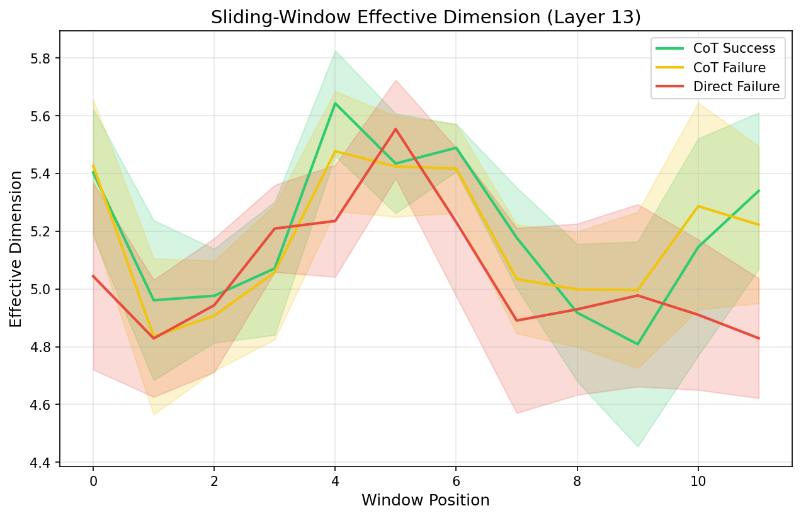
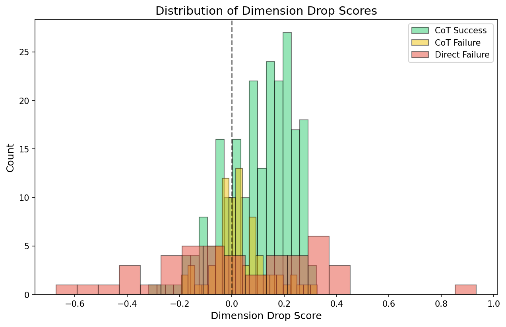

# Experiment 13: Regime Mining and Failure Subtyping

**Generated**: 2026-02-02 20:26
**Model**: Qwen/Qwen2.5-0.5B
**Analysis Layer**: 13

---

## Dataset Overview

| Group | Description | N |
|---|---|---|
| G1 | Direct Failure | 62 |
| G2 | Direct Success | 52 |
| G3 | CoT Failure | 77 |
| G4 | CoT Success | 223 |

---

## Analysis 1: Failure Subtyping within G3 (CoT Failures)

### Silhouette Scores

| k | Silhouette Score |
|---|---|
| 2 | 0.373 |
| 3 | 0.435 |
| 4 | 0.401 |

**Best k = 3** (highest silhouette score)

### k = 2 Cluster Analysis

#### Cluster Centroids (Original Scale)

| Cluster | N | speed | dir_consistency | stabilization | turning_angle | dir_autocorr | tortuosity | effective_dim | cos_slope | dist_slope | early_late_ratio |
|---|---|---|---|---|---|---|---|---|---|---|---|
| 0 | 31 | 14.580 | 0.056 | 0.008 | 1.928 | -0.346 | 0.042 | 12.796 | 0.003 | -0.050 | 1.023 |
| 1 | 46 | 14.361 | 0.064 | -0.017 | 1.918 | -0.336 | 0.045 | 14.188 | 0.002 | -0.027 | 0.940 |
| G4 (ref) | 223 | 14.280 | 0.058 | -0.012 | 1.916 | -0.334 | 0.043 | 12.982 | 0.003 | -0.053 | 1.016 |

### k = 3 Cluster Analysis

#### Cluster Centroids (Original Scale)

| Cluster | N | speed | dir_consistency | stabilization | turning_angle | dir_autocorr | tortuosity | effective_dim | cos_slope | dist_slope | early_late_ratio |
|---|---|---|---|---|---|---|---|---|---|---|---|
| 0 | 15 | 14.224 | 0.057 | -0.016 | 1.912 | -0.331 | 0.043 | 12.069 | 0.004 | -0.060 | 1.040 |
| 1 | 44 | 14.378 | 0.064 | -0.016 | 1.919 | -0.337 | 0.045 | 14.261 | 0.001 | -0.026 | 0.936 |
| 2 | 18 | 14.810 | 0.055 | 0.024 | 1.938 | -0.355 | 0.041 | 13.376 | 0.003 | -0.044 | 1.010 |
| G4 (ref) | 223 | 14.280 | 0.058 | -0.012 | 1.916 | -0.334 | 0.043 | 12.982 | 0.003 | -0.053 | 1.016 |

### Interpretation

Based on cluster centroids:
- **Stable-but-wrong subtype**: Look for clusters with high tortuosity, high DC, normal convergence
- **Failed exploration subtype**: Look for clusters with high effective dimension, weak convergence

---

## Analysis 2: Direct Success Characterization (G2 vs G4)

### Comparison Table

| Metric | G2 Mean | G4 Mean | Cohen's d | p-value | Prediction | Confirmed? |
|---|---|---|---|---|---|---|
| speed | 13.7062 | 14.2805 | -2.64 | 0.0000 |  |  |
| dir_consistency | 0.0849 | 0.0580 | 2.19 | 0.0000 | G2 > G4 | ✓ |
| stabilization | -0.0159 | -0.0117 | -0.17 | 0.2890 |  |  |
| turning_angle | 1.8778 | 1.9158 | -2.97 | 0.0000 |  |  |
| dir_autocorr | -0.3000 | -0.3340 | 2.82 | 0.0000 |  |  |
| tortuosity | 0.0625 | 0.0434 | 1.92 | 0.0000 | G2 > G4 | ✓ |
| effective_dim | 8.4693 | 12.9819 | -4.98 | 0.0000 | G2 < G4 | ✓ |
| cos_slope | 0.0061 | 0.0035 | 1.86 | 0.0000 |  |  |
| dist_slope | -0.1045 | -0.0534 | -1.95 | 0.0000 | G2 < G4 | ✓ |
| early_late_ratio | 1.0702 | 1.0157 | 1.32 | 0.0000 |  |  |

**Retrieve-and-Commit Predictions Confirmed**: 4/4

---

## Analysis 3: Sliding-Window Effective Dimension (Phase Detection)

### Dimension Drop Scores (Early Mean - Late Mean)

| Group | N | Mean Drop | Std | % Positive |
|---|---|---|---|---|
| G4 | 223 | 0.102 | 0.129 | 77.6% |
| G3 | 77 | 0.029 | 0.103 | 58.4% |
| G1 | 45 | 0.019 | 0.306 | 51.1% |

**G4 vs G3 comparison**: Cohen's d = 0.59, p = 0.0000

### Figures

---

## Analysis 4: Regime Classification (All Trajectories)

### Silhouette Scores

| k | Silhouette Score |
|---|---|
| 3 | 0.577 |
| 4 | 0.577 |
| 5 | 0.428 |
| 6 | 0.503 |

**Best k = 3**

### Cluster Analysis (k = 3)

#### Cluster Composition

| Cluster | N | %G1 | %G2 | %G3 | %G4 |
|---|---|---|---|---|---|
| 0 | 300 | 0.0 | 0.0 | 25.7 | 74.3 |
| 1 | 17 | 100.0 | 0.0 | 0.0 | 0.0 |
| 2 | 97 | 46.4 | 53.6 | 0.0 | 0.0 |

#### Cluster Centroids

| Cluster | speed | dir_consistency | stabilization | turning_angle | dir_autocorr | tortuosity | effective_dim | cos_slope | dist_slope | early_late_ratio |
|---|---|---|---|---|---|---|---|---|---|---|
| 0 | 14.324 | 0.059 | -0.010 | 1.917 | -0.336 | 0.043 | 13.148 | 0.003 | -0.049 | 1.005 |
| 1 | 11.155 | 0.364 | -1.388 | 1.766 | -0.193 | 0.358 | 2.651 | 0.128 | -2.461 | 1.458 |
| 2 | 13.607 | 0.076 | -0.015 | 1.878 | -0.299 | 0.052 | 8.857 | 0.005 | -0.084 | 1.061 |

*UMAP not installed - visualization skipped*

---

## Analysis 5: Predictive Value of Trajectory Geometry

### Prediction Results (5-Fold CV)

| Model | N | Accuracy | AUC |
|---|---|---|---|
| CoT Only | 300 | 0.750 | 0.772 |
| Direct Only | 114 | 0.806 | 0.898 |
| All (Metrics + Prompt) | 414 | 0.749 | 0.767 |
| Prompt Type Only | 414 | 0.689 | 0.629 |

### Feature Importance (|Coefficient|)

| Rank | Metric | |Coefficient| |
|---|---|---|
| 1 | early_late_ratio | 1.664 |
| 2 | tortuosity | 1.570 |
| 3 | dist_slope | 1.468 |
| 4 | cos_slope | 1.186 |
| 5 | speed | 0.653 |
| 6 | stabilization | 0.612 |
| 7 | effective_dim | 0.423 |
| 8 | dir_autocorr | 0.270 |
| 9 | turning_angle | 0.232 |
| 10 | dir_consistency | 0.045 |

---

## Summary of Findings

### Key Discoveries

1. **Failure Subtyping (G3)**: CoT failures cluster into distinct geometric subtypes

2. **Direct Success (G2)**: Tested 'retrieve-and-commit' hypothesis against G4

3. **Phase Detection**: Dimension-drop analysis reveals explore→commit dynamics

4. **Regime Classification**: Unsupervised clustering identifies trajectory families

5. **Predictive Power**: Trajectory metrics can predict success beyond prompt type

---

*Report generated by run_exp13_analysis.py*