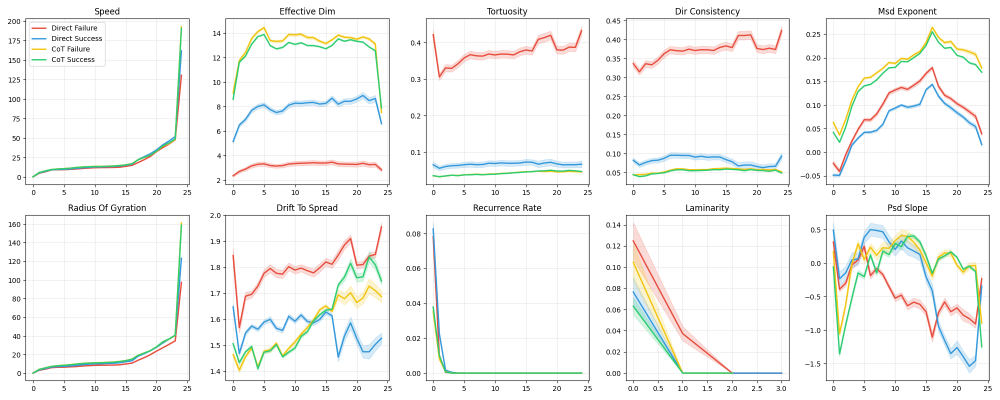
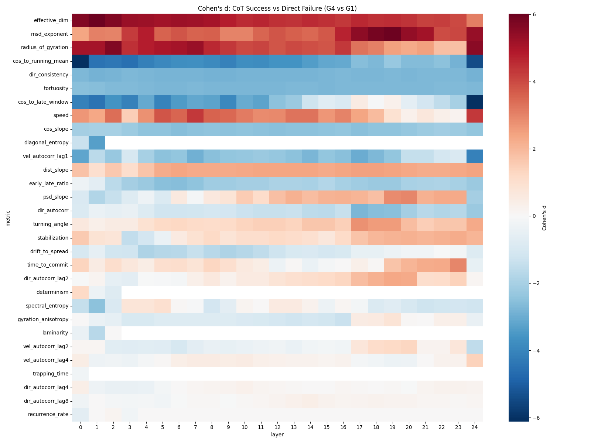
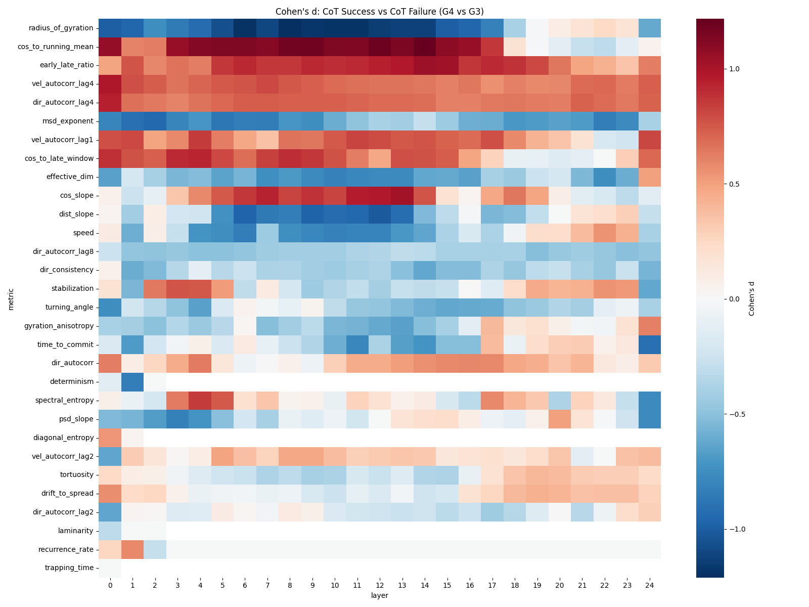
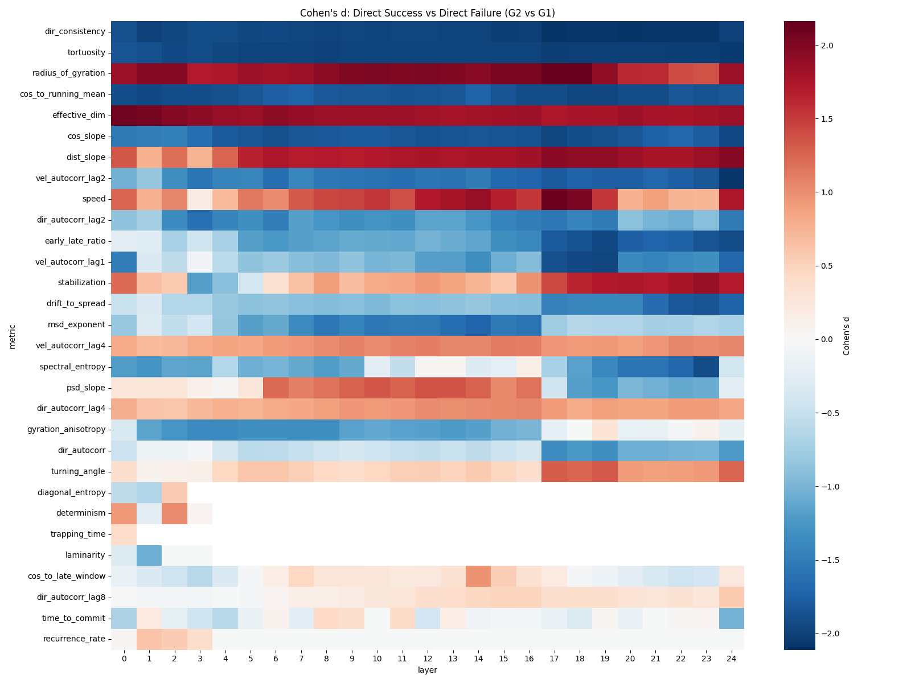
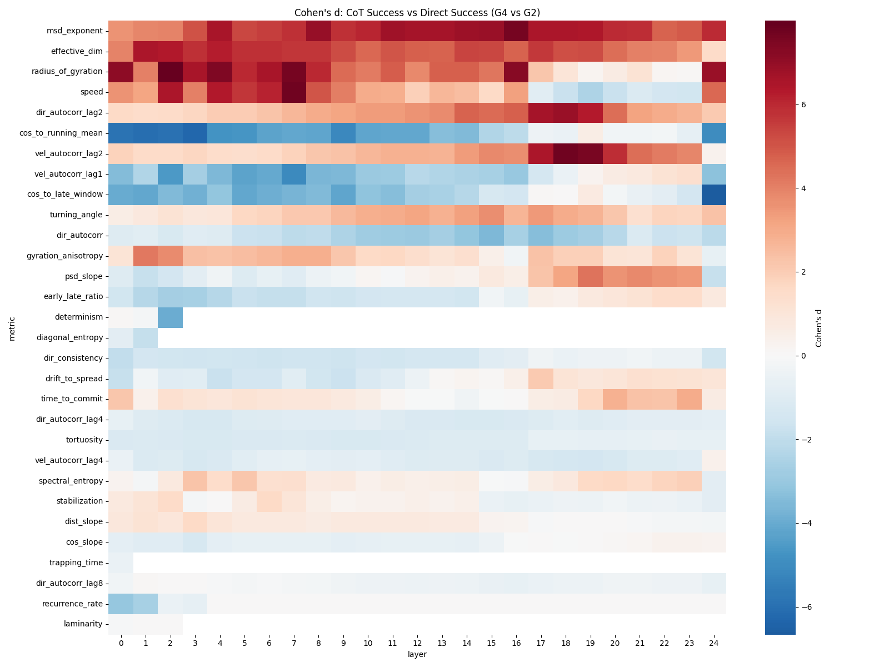
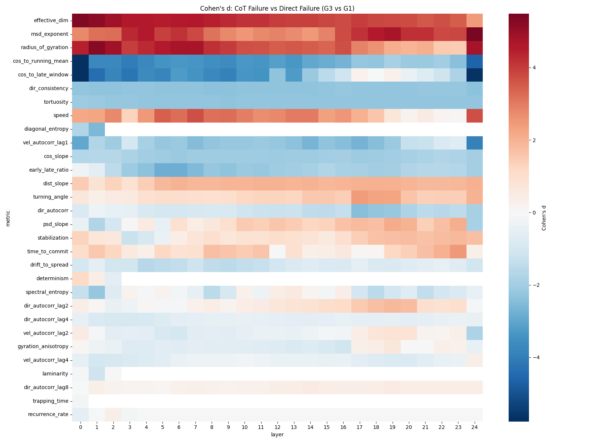
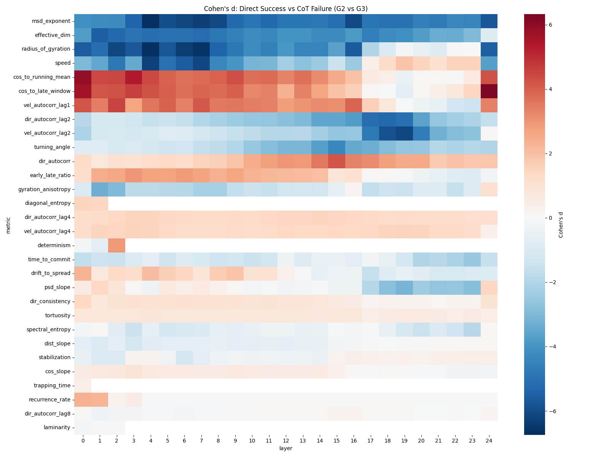

# Experiment 14: Extended Trajectory Geometry Analysis
**Generated**: 2026-02-03 17:00

## Key Findings

### Top Discriminators (G4 vs G1)
| Layer | Metric | Cohen's d |
|---|---|---|
| 24 | cos_to_late_window | -6.12 |
| 0 | cos_to_running_mean | -6.06 |
| 19 | msd_exponent | 6.01 |
| 1 | effective_dim | 6.00 |
| 18 | msd_exponent | 5.84 |
| 0 | effective_dim | 5.66 |
| 2 | effective_dim | 5.65 |
| 2 | radius_of_gyration | 5.65 |
| 24 | radius_of_gyration | 5.50 |
| 17 | msd_exponent | 5.45 |
| 24 | cos_to_running_mean | -5.41 |
| 20 | msd_exponent | 5.38 |
| 24 | msd_exponent | 5.35 |
| 7 | radius_of_gyration | 5.29 |
| 3 | effective_dim | 5.29 |
| 4 | effective_dim | 5.24 |
| 6 | effective_dim | 5.23 |
| 7 | effective_dim | 5.19 |
| 21 | msd_exponent | 5.13 |
| 5 | effective_dim | 5.12 |

### Success Comparison: CoT vs Direct (G4 vs G2)
Top differences between successful CoT and successful Direct answers.

| Layer | Metric | Cohen's d | G4 Mean | G2 Mean |
|---|---|---|---|---|
| 2 | radius_of_gyration | 8.00 | 5.9154 | 5.1760 |
| 7 | speed | 7.76 | 12.3915 | 11.2059 |
| 18 | vel_autocorr_lag2 | 7.76 | -88.0987 | -164.9292 |
| 16 | msd_exponent | 7.64 | 0.2551 | 0.1437 |
| 7 | radius_of_gyration | 7.60 | 9.9471 | 8.4748 |
| 19 | vel_autocorr_lag2 | 7.57 | -109.5709 | -208.6534 |
| 4 | radius_of_gyration | 7.43 | 8.2253 | 7.2723 |
| 16 | radius_of_gyration | 7.26 | 15.1894 | 13.5048 |
| 0 | radius_of_gyration | 7.09 | 0.4091 | 0.3530 |
| 8 | msd_exponent | 6.96 | 0.1672 | 0.0592 |
| 18 | dir_autocorr_lag2 | 6.91 | -0.1365 | -0.2278 |
| 15 | msd_exponent | 6.89 | 0.2261 | 0.1325 |
| 24 | radius_of_gyration | 6.85 | 158.7548 | 123.3036 |
| 14 | msd_exponent | 6.85 | 0.2093 | 0.1017 |
| 11 | msd_exponent | 6.76 | 0.1923 | 0.1001 |

### Failure Comparison: CoT vs Direct (G3 vs G1)
Top differences between CoT failures and Direct failures.

| Layer | Metric | Cohen's d | G3 Mean | G1 Mean |
|---|---|---|---|---|
| 0 | cos_to_late_window | -5.77 | 0.4083 | 0.6890 |
| 0 | cos_to_running_mean | -5.75 | 0.5677 | 0.8650 |
| 24 | cos_to_late_window | -5.66 | 0.7332 | 0.8586 |
| 24 | msd_exponent | 5.48 | 0.1784 | 0.0392 |
| 0 | effective_dim | 5.37 | 9.1121 | 2.3540 |
| 1 | radius_of_gyration | 5.26 | 4.3798 | 3.3324 |
| 1 | effective_dim | 5.16 | 11.7576 | 2.7024 |
| 2 | effective_dim | 4.88 | 12.4162 | 2.8959 |
| 2 | radius_of_gyration | 4.88 | 5.9639 | 4.5828 |
| 24 | radius_of_gyration | 4.80 | 161.1841 | 97.4412 |
| 19 | msd_exponent | 4.76 | 0.2345 | 0.1137 |
| 6 | radius_of_gyration | 4.74 | 9.3798 | 6.9638 |
| 7 | radius_of_gyration | 4.73 | 10.1242 | 7.3350 |
| 24 | cos_to_running_mean | -4.66 | 0.8114 | 0.9466 |
| 7 | effective_dim | 4.65 | 13.3131 | 3.1463 |

## Visualizations

### Layer Evolution

### Heatmaps
**CoT Success vs Direct Failure**

**CoT Success vs CoT Failure**

**Direct Success vs Direct Failure**

**CoT Success vs Direct Success**

**CoT Failure vs Direct Failure**

**Direct Success vs CoT Failure**

