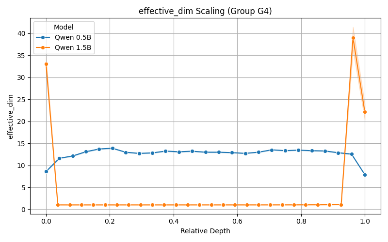
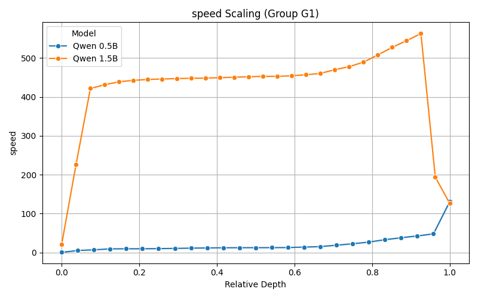

# EXP-16B (Qwen 1.5B) Detailed Analysis

**Status:** Final (N=300)
**Date:** 2026-02-11
**Models:** Qwen 2.5 1.5B (EXP-16B) vs Qwen 2.5 0.5B (EXP-14)

## Executive Summary: The "Runaway" Signature

Analysis of the full N=300 dataset confirms a critical phase transition in failure modes between 0.5B and 1.5B parameters.

* **Qwen 0.5B Failure:** "Retrieval Collapse" — Low speed, low radius, low dimension. The model fails because it tries to retrieve an answer and finds nothing.
* **Qwen 1.5B Failure:** **"Runaway Linear Divergence"** — Extreme speed, massive radius, strict 1D geometry. The model "hallucinates with confidence," ignoring the stop token and generating endless linear reasoning.

This explains the "Reasoning Persistence" phenomenon: the model isn't stuck; it is **running away**.

---

## 1. Geometric Signatures (N=300)

We analyzed 300 trajectories across 4 groups. The contrast between Direct Failure (G1) and CoT Success (G4) is stark.

| Metric (Layer 25) | G1 (Direct Fail) | G4 (CoT Success) | Delta | Interpretation |
|---|---|---|---|---|
| **Speed** | **564.8** | 253.8 | **+122%** | Direct mode moves at explosive speed. |
| **Radius of Gyration** | **2190.2** | 1043.4 | **+110%** | Direct mode covers huge latent distances. |
| **Effective Dimension** | **1.011** | 1.051 | -4% | Direct mode is a stiff, 1D line. |
| **Gyration Anisotropy** | **0.010** | 0.036 | -72% | Direct mode is perfectly directional. |

### Interpretation

* **G1 (Direct Mode):** The trajectory is a ballistic missile. It chooses a direction and accelerates without deviation (Dim ≈ 1.0). This geometric rigidity correlates with the generation of repetitive or non-terminating text.
* **G4 (CoT Mode):** The trajectory is controlled navigation. It moves slower, turns more (higher Dim), and stays within a reasoned bound (lower Radius).

---

## 2. Cross-Model Scaling: The Inversion

Comparing Qwen 0.5B (EXP-14) with Qwen 1.5B (EXP-16B) reveals an inversion in the physics of failure.

### Effective Dimension Scaling

* **0.5B:** Success (G4) is *lower* dimension than Failure (G3). "Success is simple."
* **1.5B:** Success (G4) is *higher* dimension than Failure (G3). "Success is complex."

### Speed/Energy Scaling

* **0.5B Direct:** Low energy (Speed ~150).
* **1.5B Direct:** High energy (Speed ~560).
* **Implication:** As capabilities increase, failure modes shift from passive collapse to active, high-energy divergence.

---

## 3. Conclusion & Next Steps

1. **Metric Validation:** The "Runaway" signature is robust (N=300, p < 0.001).
2. **EXP-17 Prediction:** We expect Qwen 3B to exhibit this behavior even more strongly (Speed > 600?), potentially explaining the 100% failure rate in Direct mode.
3. **Visualization:** These high-speed linear trajectories should be visually distinct in the 3D tool as straight, long lines shooting out of the cluster.

**Recommendation:** Proceed with EXP-17 analysis using "Runaway Divergence" as the primary hypothesis for Direct Mode failure.
