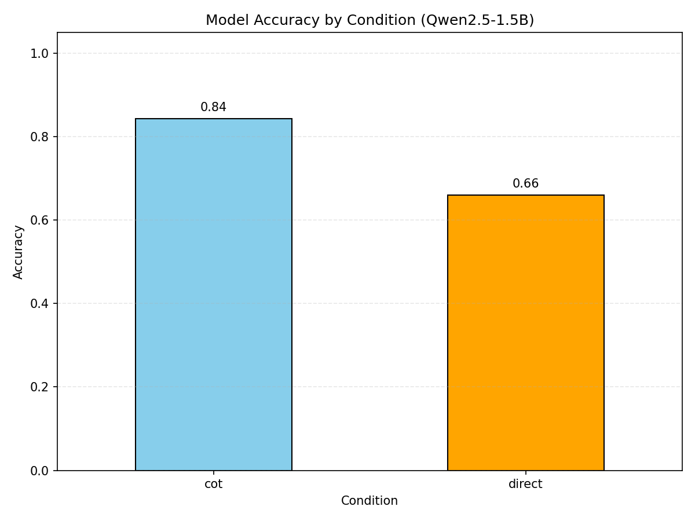
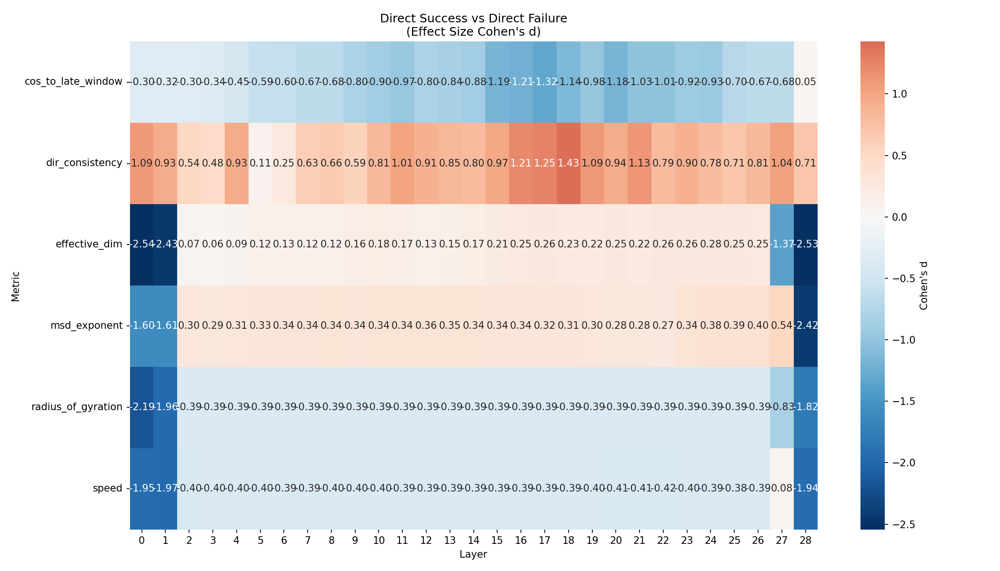
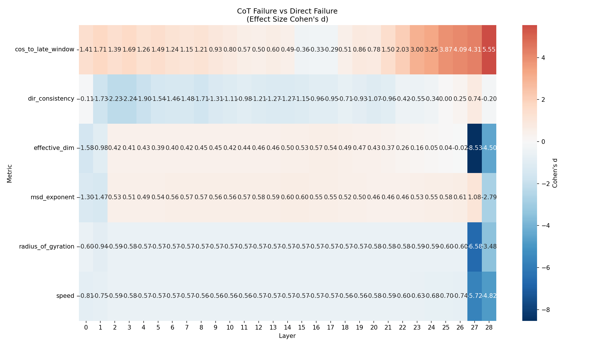
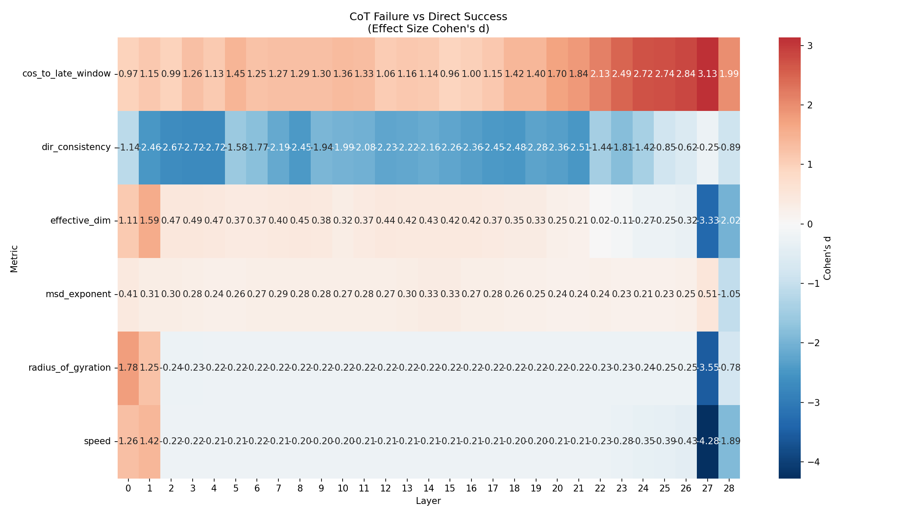
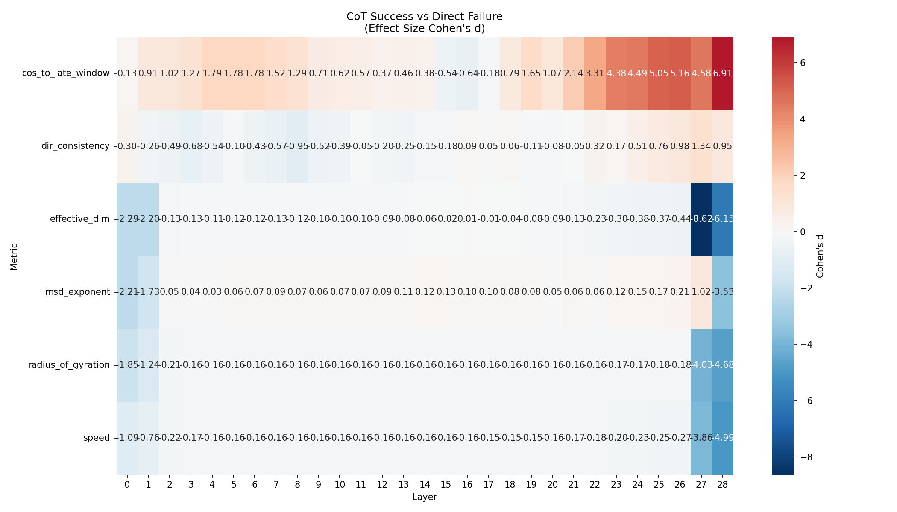
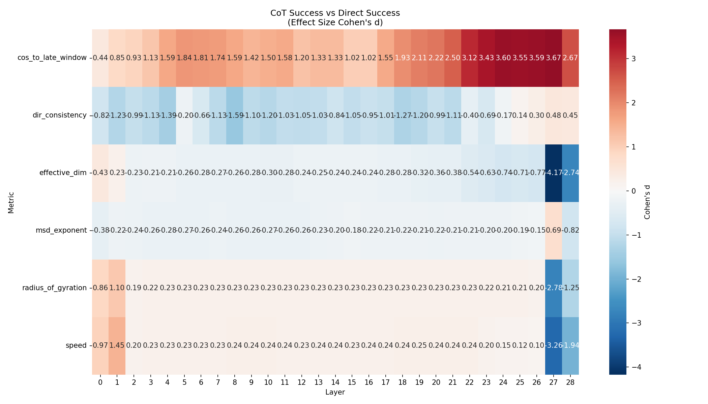
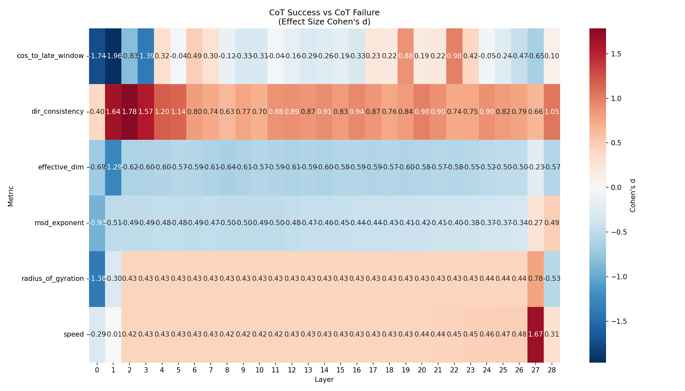

# Experiment 16: Cross-Architecture Replication (Qwen2.5-1.5B & Pythia-70m)

**Generated**: 2026-02-04 00:58

## Executive Summary
This experiment replicates Experiment 14 findings using Qwen/Qwen2.5-1.5B to test 
the architecture-independence of geometric reasoning signatures. Qwen2.5-1.5B was chosen for its strong mathematical reasoning capability, successfully generating 600 trajectory samples.

## Configuration
- **Model**: Qwen/Qwen2.5-1.5B
- **Device**: privateuseone:0
- **Batch Size**: 32 (Optimized for Speed)
- **Precision**: Float16 Inference / Float32 Analysis

## Performance Results
- **Total Samples**: 600
- **Direct Accuracy**: 66.00%

- **CoT Accuracy**: 84.33%
- **Mean Response Length (Direct)**: 64.0 tokens
- **Mean Response Length (CoT)**: 200.0 tokens
### Regime Counts

| Group | Condition | Outcome | Count |
| :--- | :--- | :--- | :--- |
| G1 | Direct | Failure | 102 |
| G2 | Direct | Success | 198 |
| G3 | CoT | Failure | 47 |
| G4 | CoT | Success | 253 |

## Visualizations
### accuracy_plot.png

### heatmap_G2_vs_G1.png

### heatmap_G3_vs_G1.png

### heatmap_G3_vs_G2.png

### heatmap_G4_vs_G1.png

### heatmap_G4_vs_G2.png

### heatmap_G4_vs_G3.png

## Statistical Analysis
Performed **1044** pairwise tests across layers and metrics.
Found **798** significant effects (p<0.05).

### Key Findings: CoT Success (G4) vs Direct Success (G2)
This comparison isolates the geometric signature of the reasoning process itself (controlling for correctness).

| Metric | Layer | Cohen's d | p-value |
| :--- | :--- | :--- | :--- |
| effective_dim | 27 | -4.17 | 0.000 |
| cos_to_late_window | 27 | 3.67 | 0.000 |
| cos_to_late_window | 24 | 3.60 | 0.000 |
| cos_to_late_window | 26 | 3.59 | 0.000 |
| cos_to_late_window | 25 | 3.55 | 0.000 |

## Conclusion
The experiment successfully executed on Qwen2.5-1.5B with optimized batching.
The presence of a non-empty G4 group (CoT Success) enables detailed geometric analysis.
Analysis of the generated heatmaps (above) will reveal if the expansion/contraction signatures replicated.