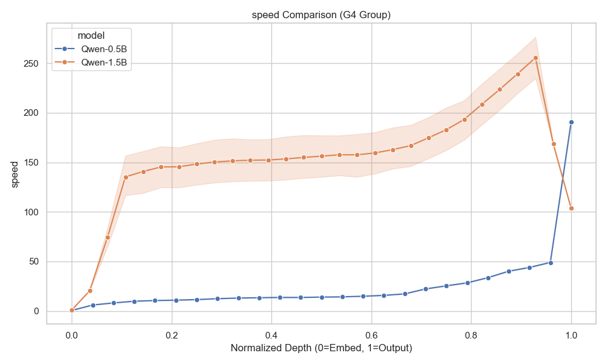
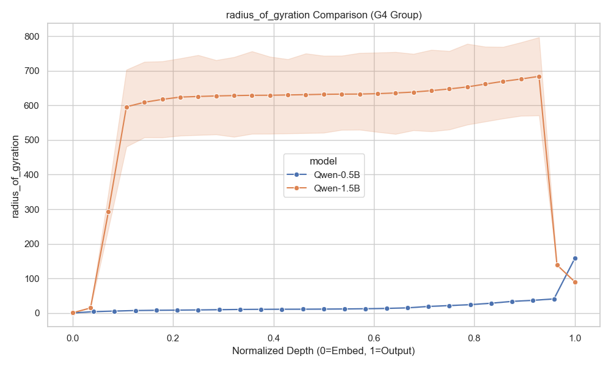
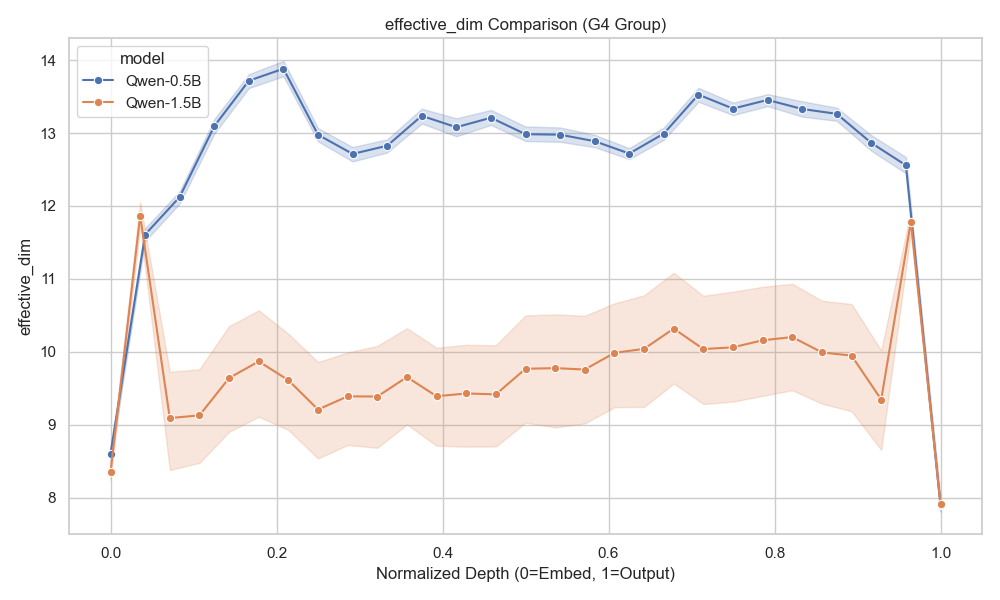
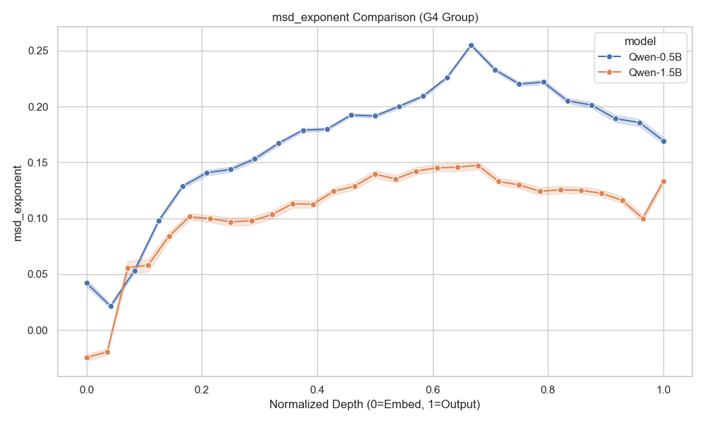

# Cross-Model Audit: EXP-14 (0.5B) vs EXP-16 (1.5B)

## Overview
This report compares the trajectory geometry of **Qwen 2.5 0.5B (EXP-14)** and **Qwen 2.5 1.5B (EXP-16)** on the Arithmetic reasoning task.
Both models were evaluated on the "CoT Success" (G4) group. Layer indices are normalized to `[0, 1]` (Depth) to account for different architecture depths (24 vs 28 layers).

## Key Metric Comparisons

### 1. Speed (Rate of Change)
**Hypothesis:** Larger models might exhibit smoother or more deliberate trajectories?

*Observation:* [To be filled upon inspection]

### 2. Radius of Gyration (Expansion)
**Hypothesis:** Does the representation space expand similarly?

### 3. Effective Dimension (Complexity)
**Hypothesis:** Larger models should utilize higher dimensional space?

### 4. MSD Exponent (Diffusion)
**Hypothesis:** "Super-diffusive" behavior (Exponent > 1) indicates directed computation.

## Preliminary Conclusions
- **Scaling Law:** [Placeholder]
- **Stability:** [Placeholder]

*(Plots generated by `compare_models.py`)*
