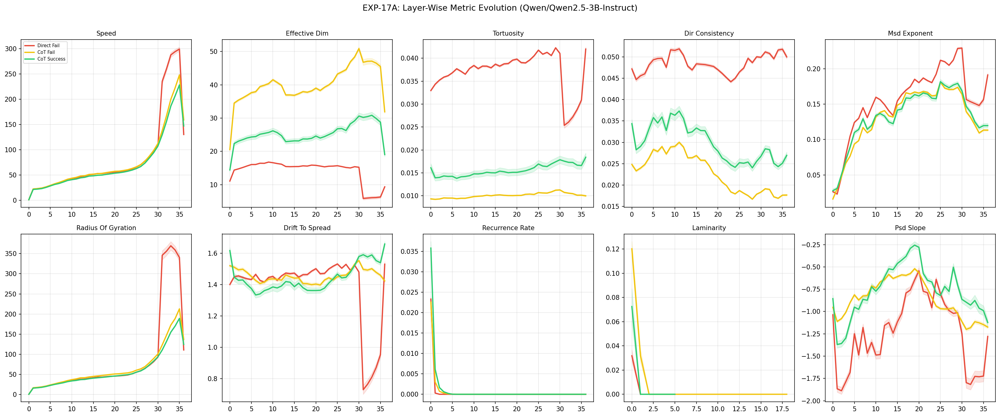
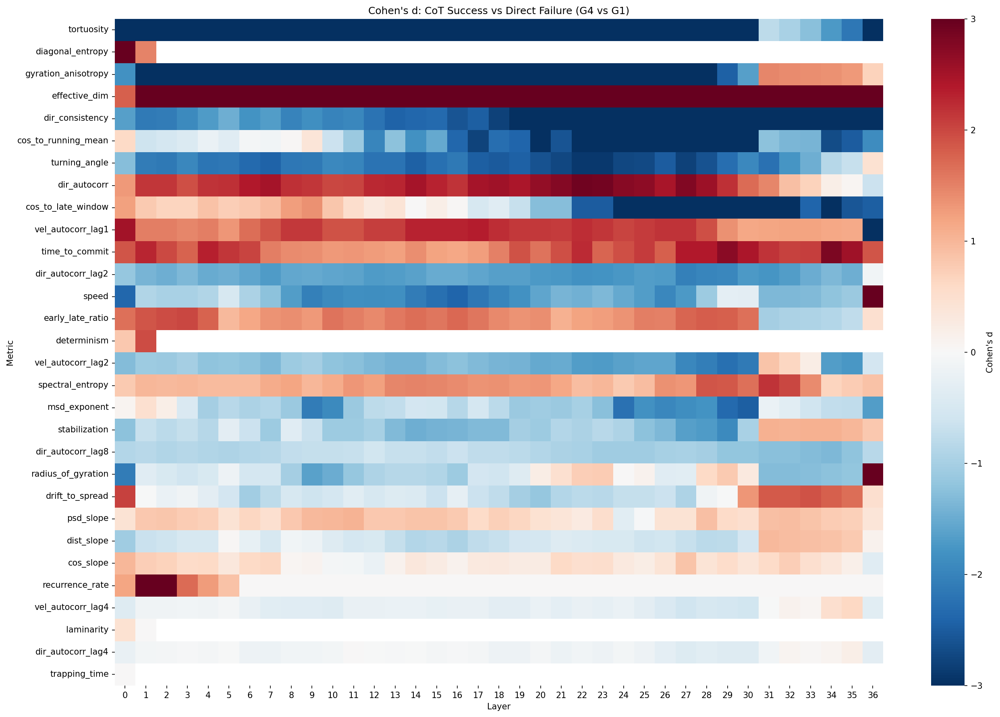
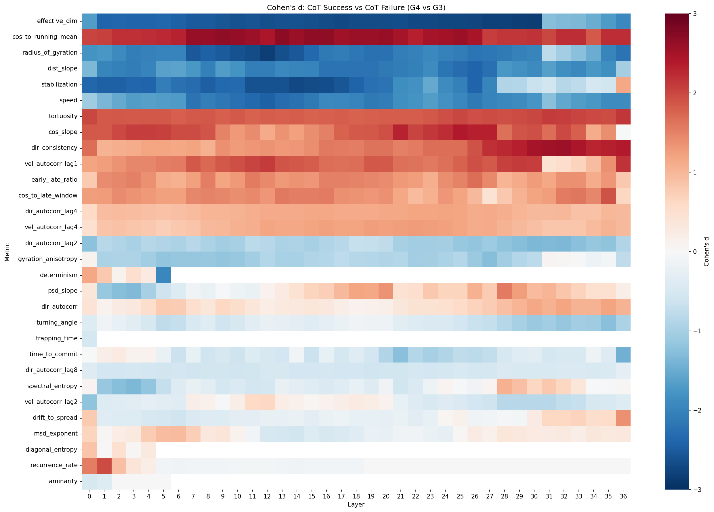
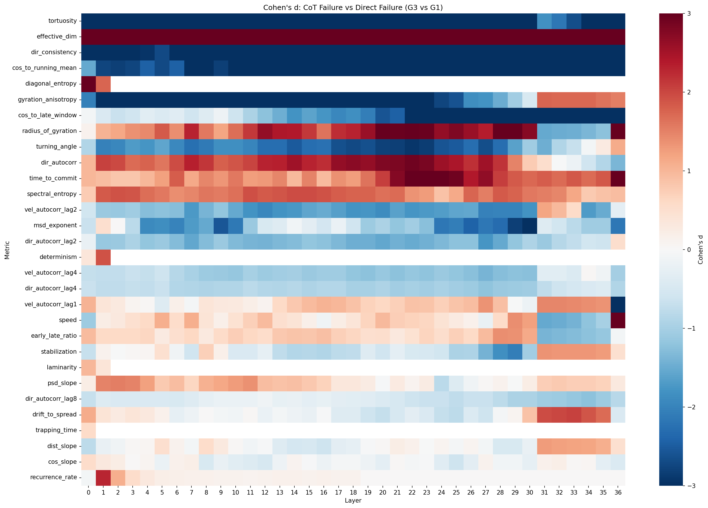

# EXP-17A: Baseline Replication Report

**Model:** Qwen/Qwen2.5-3B-Instruct
**Generated:** 2026-02-11 08:33
**Layers:** 37 (0–36)

## Group Distribution

| Group | Label | N (samples) |
|---|---|---|
| G1 | Direct Fail | 300 |
| G2 | Direct Success | 0 ⚠️ **MISSING** |
| G3 | CoT Fail | 245 |
| G4 | CoT Success | 55 |

> [!WARNING]
> **No Direct Success (G2) group exists.** Qwen2.5-3B-Instruct fails ALL 300 direct-answer problems.
> This suggests the model requires Chain-of-Thought prompting for arithmetic, or the parsing heuristic is too strict.

## Regime Classification

**Observed Regime: MIXED / NOVEL**

| Metric | Description | Mean Cohen's d | Sig. Layers | G4 Direction | EXP-14 Expected | Match? |
|---|---|---|---|---|---|---|
| `radius_of_gyration` | Spatial extent of computation | -0.435 | 25/37 | ↓ Lower | ↑ | ❌ |
| `effective_dim` | Dimensionality of trajectory | +3.827 | 37/37 | ↑ Higher | ↑ | ✅ |
| `msd_exponent` | Diffusion regime | -1.047 | 31/37 | ↓ Lower | ↑ | ❌ |
| `time_to_commit` | Explore → Commit transition | +1.869 | 37/37 | ↑ Higher | ↑ | ✅ |
| `dir_consistency` | Directional stability | -3.031 | 37/37 | ↓ Lower | ↓ | ✅ |
| `tortuosity` | Path complexity | -5.687 | 37/37 | ↓ Lower | ↑ | ❌ |
| `speed` | Step magnitude per layer | -1.334 | 35/37 | ↓ Lower | ↑ | ❌ |

## Primary Comparison: G4 (CoT Success) vs G1 (Direct Fail)

Total comparisons: 972
Significant (p<0.05, |d|>0.5): 770

### Top 20 Discriminators

| Layer | Metric | Cohen's d | G4 Mean | G1 Mean | p-value |
|---|---|---|---|---|---|
| 28 | `cos_to_running_mean` | -8.889 | 0.6860 | 0.7842 | 0.000 |
| 0 | `diagonal_entropy` | +8.372 | 1.1157 | 0.0160 | 0.000 |
| 29 | `cos_to_running_mean` | -8.089 | 0.6919 | 0.7955 | 0.000 |
| 27 | `tortuosity` | -7.808 | 0.0164 | 0.0413 | 0.000 |
| 29 | `tortuosity` | -7.472 | 0.0174 | 0.0423 | 0.000 |
| 27 | `cos_to_running_mean` | -7.407 | 0.7072 | 0.7841 | 0.000 |
| 25 | `tortuosity` | -7.281 | 0.0169 | 0.0418 | 0.000 |
| 30 | `cos_to_running_mean` | -7.266 | 0.6915 | 0.7952 | 0.000 |
| 5 | `tortuosity` | -7.158 | 0.0143 | 0.0368 | 0.000 |
| 8 | `tortuosity` | -7.109 | 0.0142 | 0.0365 | 0.000 |
| 7 | `tortuosity` | -7.108 | 0.0141 | 0.0372 | 0.000 |
| 26 | `tortuosity` | -7.104 | 0.0165 | 0.0409 | 0.000 |
| 30 | `tortuosity` | -7.048 | 0.0179 | 0.0410 | 0.000 |
| 23 | `tortuosity` | -6.825 | 0.0158 | 0.0396 | 0.000 |
| 6 | `tortuosity` | -6.809 | 0.0138 | 0.0377 | 0.000 |
| 9 | `tortuosity` | -6.791 | 0.0144 | 0.0378 | 0.000 |
| 4 | `tortuosity` | -6.738 | 0.0142 | 0.0362 | 0.000 |
| 28 | `tortuosity` | -6.633 | 0.0170 | 0.0406 | 0.000 |
| 20 | `tortuosity` | -6.608 | 0.0151 | 0.0398 | 0.000 |
| 26 | `cos_to_running_mean` | -6.505 | 0.7145 | 0.7875 | 0.000 |

## G4 (CoT Success) vs G3 (CoT Fail)

Significant: 736

### Top Discriminators

| Layer | Metric | Cohen's d | G4 Mean | G3 Mean | p-value |
|---|---|---|---|---|---|
| 30 | `effective_dim` | -2.849 | 30.6332 | 50.8941 | 0.000 |
| 29 | `effective_dim` | -2.814 | 29.2044 | 48.3694 | 0.000 |
| 12 | `radius_of_gyration` | -2.813 | 37.1452 | 41.6957 | 0.000 |
| 28 | `effective_dim` | -2.812 | 28.2669 | 46.8765 | 0.000 |
| 27 | `effective_dim` | -2.805 | 26.2800 | 44.5499 | 0.000 |
| 26 | `effective_dim` | -2.762 | 26.8947 | 43.8665 | 0.000 |
| 25 | `effective_dim` | -2.737 | 26.7970 | 43.2241 | 0.000 |
| 24 | `effective_dim` | -2.720 | 25.6505 | 41.0698 | 0.000 |
| 23 | `effective_dim` | -2.704 | 25.0494 | 39.9705 | 0.000 |
| 14 | `stabilization` | -2.703 | -0.0688 | 0.0414 | 0.000 |
| 22 | `effective_dim` | -2.701 | 24.4545 | 39.2536 | 0.000 |
| 17 | `effective_dim` | -2.697 | 23.7528 | 37.9511 | 0.000 |
| 15 | `stabilization` | -2.693 | -0.0711 | 0.0392 | 0.000 |
| 18 | `effective_dim` | -2.689 | 23.7222 | 37.7704 | 0.000 |
| 11 | `radius_of_gyration` | -2.688 | 35.2309 | 39.0024 | 0.000 |

## G3 (CoT Fail) vs G1 (Direct Fail)

Significant: 736

### Top Discriminators

| Layer | Metric | Cohen's d | G3 Mean | G1 Mean | p-value |
|---|---|---|---|---|---|
| 27 | `tortuosity` | -13.516 | 0.0106 | 0.0413 | 0.000 |
| 25 | `tortuosity` | -13.359 | 0.0107 | 0.0418 | 0.000 |
| 29 | `tortuosity` | -13.346 | 0.0112 | 0.0423 | 0.000 |
| 26 | `tortuosity` | -12.724 | 0.0106 | 0.0409 | 0.000 |
| 30 | `tortuosity` | -12.721 | 0.0113 | 0.0410 | 0.000 |
| 28 | `tortuosity` | -12.011 | 0.0109 | 0.0406 | 0.000 |
| 5 | `tortuosity` | -11.831 | 0.0095 | 0.0368 | 0.000 |
| 23 | `tortuosity` | -11.742 | 0.0104 | 0.0396 | 0.000 |
| 8 | `tortuosity` | -11.638 | 0.0095 | 0.0365 | 0.000 |
| 7 | `tortuosity` | -11.431 | 0.0095 | 0.0372 | 0.000 |
| 24 | `tortuosity` | -11.315 | 0.0103 | 0.0405 | 0.000 |
| 4 | `tortuosity` | -11.273 | 0.0095 | 0.0362 | 0.000 |
| 9 | `tortuosity` | -10.792 | 0.0097 | 0.0378 | 0.000 |
| 22 | `tortuosity` | -10.760 | 0.0103 | 0.0390 | 0.000 |
| 0 | `tortuosity` | -10.705 | 0.0093 | 0.0330 | 0.000 |

## Visualizations

### Layer Evolution

### Cohen's d Heatmaps

**CoT Success vs Direct Failure**

**CoT Success vs CoT Failure**

**CoT Failure vs Direct Failure**

## Interpretation Notes

- G4 (n=55) is small; effect sizes may be unstable. Interpret cautiously.
- The absence of G2 suggests Qwen 3B cannot perform multi-step arithmetic via direct retrieval.
- Compare regime classification against EXP-14 (Qwen 0.5B) and EXP-16B (Qwen 1.5B) for scale stability.
